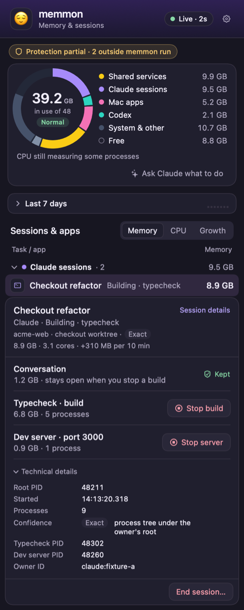
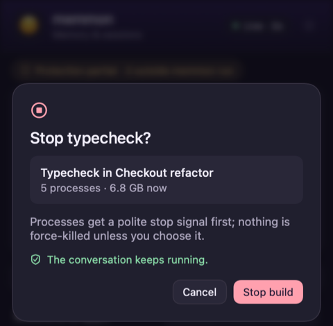
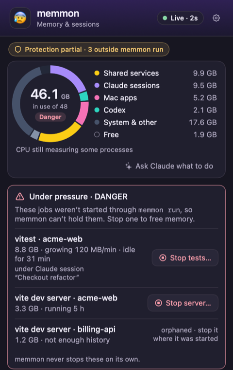
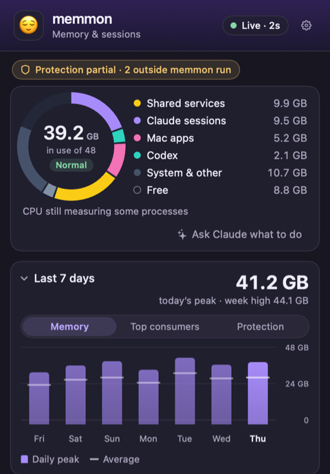
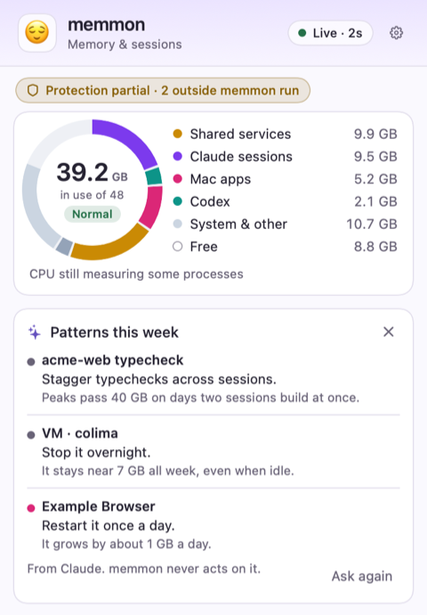
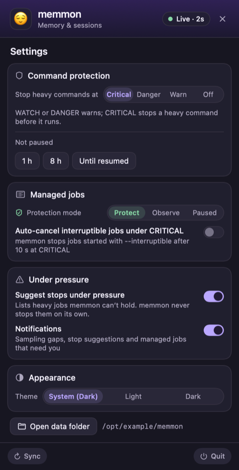

# memmon

A macOS memory monitor that shows which Claude session, Codex thread or app owns
each process.

Activity Monitor reports memory correctly, but it shows fifteen processes called
`node` and cannot say which session started one, whether that session finished an
hour ago, or whether stopping it loses work. memmon answers those questions. It
groups every process under one owner, lets you stop a single build or server after
a confirm, and tells Claude sessions to back off before they start another heavy
command.


| | |
|---|---|
|  |  |
| A session's builds and servers, each with its own Stop. | Every stop asks first and says what keeps running. |
|  |  |
| Under pressure: the largest jobs memmon did not start. | Last 7 days: daily peak and average memory. |
|  |  |
| Ask Claude what to do, on a click only. | Settings for the gate, the runner and the theme. |

Screenshots are rendered from synthetic fixtures, not a real machine.

## Features

- **Owners.** Every process belongs to exactly one owner: a Claude session, a
  Codex thread, an app, a VM or container service, a managed job, or unattributed.
- **Safe stops.** A stop re-checks each process's identity before signalling it,
  sends SIGTERM first, and reports what is still running. Force is a separate,
  confirmed step. memmon never stops anything on its own.
- **Command protection.** A Claude Code hook warns sessions under memory pressure
  and refuses heavy commands at CRITICAL. Refused commands wait to be retried.
- **Shared job runner.** `memmon run` queues builds and tests from Claude, Codex and
  your terminal through one machine-wide slot, and starts them when memory allows.
- **Under pressure.** At DANGER or CRITICAL, memmon lists the largest heavy jobs it
  did not start, each with a confirmed stop.
- **History.** A sampler records memory once a minute for the Last 7 days chart and
  per-app reports.
- **Ask Claude.** On request, memmon asks Claude what to stop now or what patterns
  this week suggest. It shows the reply as text and never acts on it.
- **Menu bar.** A popover with light and dark themes, built locally from source.

## Requirements

macOS 13 or later, and the Xcode Command Line Tools (`xcode-select --install`) for
`/usr/bin/python3` and, for the menu bar, `swiftc`. Session names and the gate need
Claude Code. Nothing is pip-installed.

## Install

```bash
git clone https://github.com/ketan0095/claude-memmon.git memmon && cd memmon
./install.sh --sampler --menubar --gate    # or ./install.sh for the CLI alone
```

| Flag | Adds |
|---|---|
| `--sampler` | a launchd job that samples memory once a minute |
| `--menubar` | `MemmonBar.app`, compiled locally and started at login |
| `--gate` | a `PreToolUse` hook so Claude sessions back off under pressure |

`--gate` adds one hook to `~/.claude/settings.json` (backed up first) and affects
every Claude session; `--menubar` and `--sampler` add LaunchAgents under
`~/Library/LaunchAgents/`. `./install.sh --uninstall` undoes all of them.

Check the install:

```bash
memmon --once          # the dashboard renders with a verdict
pgrep -f MemmonBar     # exactly one pid, with --menubar
```

To have Claude Code install it, say *"Read CLAUDE.md and install memmon."* The
agent confirms each change with you first.

## Update

```bash
git pull --ff-only && ./install.sh --sampler --menubar --gate   # the same flags as before
```

Re-running is safe: it replaces the code, rebuilds the menu bar, never duplicates
the hook and keeps your history. See [Upgrade notes](docs/reference.md#upgrade-notes)
for behaviour changes.

After one install from a clone, later updates come from the menu bar:
**Settings → Updates → Check for updates**, then **Update now…**. From a terminal,
`memmon update --check` lists what is new and `memmon update --apply` installs it
with your original flags. It refuses when the clone has local changes, and it
contacts GitHub only when you ask.

## Privacy and permissions

memmon needs no `sudo` and no Screen Recording, Accessibility or Full Disk Access
permission. It reads only your own processes, through libproc, `top`, `ps`,
`sysctl`, `vm_stat` and `lsof`. Everything stays in `~/.claude/memmon/`. It makes no
network calls and sends no telemetry, except when you click Ask Claude or check for
updates.

## Common commands

| Command | What it does |
|---|---|
| `memmon` | live terminal dashboard |
| `memmon --once` | one snapshot |
| `memmon owners` | every process under its owner |
| `memmon act ACTION --target TOKEN` | a confirmed, identity-checked stop |
| `memmon run --label L -- CMD` | run a heavy command through the shared runner |
| `memmon jobs` | who is running and who is waiting |
| `memmon --gate-log` | what the gate has warned about and refused |
| `memmon settings` | show or change the settings |

The [full reference](docs/reference.md#commands) lists every command and flag.

## Turning it off and uninstalling

`memmon --off` pauses the gate in every session at once (`--off 8h` resumes on its
own; `memmon --on` resumes now). `./install.sh --uninstall` removes the CLI, the
app, the LaunchAgents and the hook. Your history in `~/.claude/memmon/` is kept.

## Documentation

- [Full reference](docs/reference.md): the gate, the runner, owners and stops,
  crash prediction, configuration, storage and troubleshooting.
- [CLAUDE.md](CLAUDE.md): install instructions for Claude Code and other agents.
