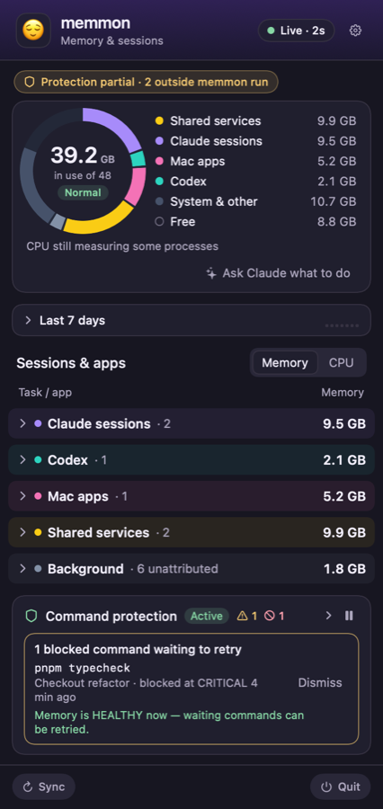

# memmon

A macOS memory monitor that answers the question Activity Monitor can't:
**which Claude Code session is eating your RAM, and what is it doing?**

Built on a 16 GB M1 that kept freezing under several concurrent Claude sessions,
after one near-freeze where two full-repo typechecks demanded ~34 GB at once.

```
 MEMMON  16.0G · 8 cores ───────────────────────────────────────── 13:26:28
 RAM   █████████████████████████████████░░░ 15.0G/16.0G  compressed 7.4G
 SWAP  ███████████████████████░░░░░░░░░░░░  6.5G/8.0G   1.21x RAM size
 ▌ DANGER   swap 1.2x RAM size · heavy thrashing 180 MB/s · load 24  1 pt → CRITICAL
            web-checkout is running tsc typecheck (21.7G across 12 processes).
            Let it finish before starting another build.

 CLAUDE SESSIONS           TOTAL    RAM  SWAP~ PROC   AGE  STATE    DOING
  ● api error handling      6.8G   2.9G   3.9G   20   34m  working  infra + flake audit
      ├ tsc typecheck web-checkout                    3.5G    23m  pid 99036
      ├ subagents  9 active (Explore, schema-auditor, …)
      └ started    Docker (2h ago) · typecheck (56m ago)
```



### Reading the popover

**Health card and protection line** — memory in use against RAM (the kernel's
own accounting, not `top`'s), the kernel pressure level and the score verdict.
Under it, one line says whether heavy commands are protected: `off`,
`paused`, `partial` (the gate is on but some heavy work was not started through
`memmon run`) or `on`. Neither line claims to prevent a freeze.

**Owners** — one row per owner (see *Owners and targeted stops* below): a
Claude session, a Codex thread or daemon, an app, a VM, a managed job, or the
unattributed rest. Sort by memory, CPU or growth. A row shows its title, what
it is doing, and where it runs (project · worktree · confidence). A value
memmon could not measure shows `—` and the reason, and sorts last. Expand a
session to see its builds, tests and servers, each with its own Stop button;
the Conversation is listed too and marked kept. Every stop asks first, inside
the popover, and the result banner reports what was measured.

The old RAM/Swap tiles, the Reclaimable card with its Reap button, and the
separate session, worktree and app lists are gone: their processes now appear
under exactly one owner, and orphaned builds show up as Unattributed. Reaping
stays on the command line (`memmon reap --apply`, then `--force` if needed).

**Command warnings & stops** — the gate's own section, below the owners. It
answers four questions in order:

- *Is protection on?* `ACTIVE` or `PAUSED`, with the Pause control next to it.
  The section is always present, so pausing is always one click away.
- *What gets checked?* Only commands matching a memory-intensive rule. Everything
  else never reaches the check at all.
- *What happens at each level?* A table: HEALTHY runs silently, WATCH and DANGER
  warn but the command still runs, CRITICAL stops it before it runs. The table
  reflects your actual policy, so it changes if you change the mode.
- *What has it actually done?* Every warning and every stop is listed as an
  event you can open.

Each event names the command, the session, when it happened, and — the part that
was missing before — **why**: which rule matched (`Built-in rule: vitest`,
`Learned rule: codex.sh run · 13 observations · warning only`) and what memory
was doing at that moment. So a stop reads as `Built-in rule: pnpm … typecheck +
CRITICAL memory → stopped` rather than as an unexplained number.

Anything still waiting to be re-run is listed in full and never collapsed —
that is work that did not happen, and it should not take a click to find.
Stops that have already been retried are history, so only the three most recent
show, behind a "show all" toggle; warnings work the same way. Events recorded
before rules were tracked say so plainly rather than being re-explained with
today's rules.

## What it looks like in practice

Two things that happened once the gate was live. Both are the same mechanism —
the session is told what the rest of the machine is doing, and decides for itself.

**A session shed its own load.** One session received a DANGER advisory while
memory was thrashing. It was running both a dev server and a test suite. Rather
than abandoning its work it killed the dev server, kept the tests, and said so:

> Memory pressure is in DANGER (paging at 111 MB/s). Killing the dev server to
> protect the test run — the api suite covers this directly, so it's the better
> signal anyway.

Measured over the following minutes: swap fell 2.1 GB and load dropped from 20 to
3 on an 8-core machine. A blanket block could not have produced that outcome —
the gate has no idea a dev server matters less than a test run. Only the session
knew.

**A session changed the question it asked.** Another was about to start a full
end-to-end run. Seeing two other worktrees holding dev servers for ~23 hours, it
put the trade-off to the human instead of just launching:

```
Memory is at its limit (swap 49%) with two other worktrees running dev
servers for ~23h. How do you want the end-to-end run done?

  1. Light E2E now, CI covers the suites
  2. Full E2E, I'll free memory first
  3. Wait and do it later
```

Neither of these is the gate blocking anything. In both cases the command was
allowed. What changed is that the session knew the pressure was not its own doing
and could name whose it was.

## Install

```bash
git clone https://github.com/ketan0095/claude-memmon.git memmon
cd memmon
./install.sh --sampler --menubar --gate
```

**Or let Claude do it.** After cloning, tell Claude Code:

> Read CLAUDE.md and install memmon.

[`CLAUDE.md`](CLAUDE.md) covers prerequisites, what to confirm with you before
touching `~/.claude/settings.json`, which permissions are needed (none), how to
verify the install, and how to uninstall.

| Flag | Adds |
|---|---|
| *(none)* | the `memmon` CLI at `~/.local/bin/memmon` |
| `--sampler` | launchd sampler, 1 sample/min, for `--report` and the menu-bar dot |
| `--menubar` | `MemmonBar.app` in the menu bar, launched at login |
| `--gate` | a `PreToolUse` hook so Claude sessions back off under pressure |
| `--uninstall` | removes everything (collected history is kept) |

Requirements: macOS 13+, `/usr/bin/python3` (Xcode Command Line Tools), and
`swiftc` for `--menubar` only. The installer preflights all of these. Nothing is
pip-installed — the CLI is Python stdlib only.

`--gate` edits `~/.claude/settings.json` to add one hook. It backs the file up
first, is idempotent, and preserves any hooks you already have.

## Giving this to someone else

### Shared heavy-job runner (Claude, Codex and terminal)

The Bash gate decides whether a command can start under memory pressure. It
does not coordinate two agents that both decide to start at the same time.
For foreground builds, tests and typechecks, opt in to the shared runner:

```bash
memmon run --label "api typecheck" -- pnpm --filter api typecheck
memmon run --label "targeted tests" --timeout 900 -- pnpm test --project api
memmon jobs
memmon jobs --json
```

All callers on the same Mac/user share the default `heavy` slot. Only one
wrapped command holds that slot at a time. The runner also checks live memory
pressure before launching: HEALTHY/WATCH can start; DANGER/CRITICAL wait. Each
wait is bounded (600 seconds by default), with progress on stderr every 15
seconds explaining the resource owner or pressure level. The terminal dashboard
and menu-bar popover show running and waiting jobs when refreshed. `jobs --json`
returns `{ "schema_version": 1, "jobs": [...] }`; each row includes a run ID,
resource, label, working directory, wrapper/child PIDs, state, reason and age.

**Use it from both agents:** replace the command the agent would execute with
`memmon run --label "<task>" -- <that command>`. Codex can call this directly
through its shell tool; no Claude hook is involved. Existing/unwrapped commands
are not intercepted or retroactively queued. Do not wrap the entire agent
session, a dev server, an interactive command, or an existing resource governor.
Avoid nested runners: they fail immediately rather than deadlocking. A
`--resource call-rig` slot can serialize a separate foreground resource, but
different resource names do not serialize each other and no slot locks files.

The wait timeout limits **acquisition**, not command runtime. Commands inherit
stdin/stdout/stderr, receive literal arguments (no implicit shell), and preserve
their exit status. Exit `124` means the wait expired without starting; `125`
means runner/pressure failure; `126`/`127` mean launch failure/missing executable;
cancellation returns `128 + signal`. A child can also return those same codes,
so use the accompanying stderr message to distinguish runner failures.

Kernel locks release on process exit and need no stale PID deletion or lease
expiry. The direct command inherits its resource lock: even SIGKILL of the
wrapper does not admit another command while that child is alive. Catchable
cancellation is forwarded to the launched command's own process group; after
five seconds a still-running direct child is killed. Detached/background jobs
that close inherited descriptors are outside this contract. Acquisition is not
FIFO; contending jobs retry until their individual deadline.

Runner metadata is local under `~/.claude/memmon/runner`. It records labels and
working directories, **not command arguments**; avoid secrets in labels. Stale
records are ignored using kernel locks and pruned on the next run. Persistent
empty `*.lock` files are intentional: deleting an in-use lock file can break
exclusivity. `memmon --off` pauses the Bash gate; it does not disable explicit
runner coordination or its pressure check. This release does not implement a
workflow-progress watchdog or account/model routing.

### Updating an existing installation

From a clean checkout of the version/branch you intend to install:

```bash
git pull --ff-only
/usr/bin/python3 -m unittest discover -v
./install.sh --sampler --menubar --gate
memmon jobs
memmon --once
memmon --gate-log
```

Use only the optional install flags you want. The installer updates local code,
rebuilds the menu-bar app, preserves history, and avoids adding a duplicate
hook. It does not update teammates automatically; each teammate installs the
reviewed revision on their own Mac. There is no hosted service or cross-machine
queue.

### Access and first installation

The upstream repository is public, so teammates can clone it directly. If you
distribute a private fork, give teammates access to that fork before installation.

**Tell them what they are agreeing to.** This is not a passive monitor. Installed
with all flags it changes four things outside its own directory, and a reasonable
person would want to know before running it:

| What | Where | Undo |
|---|---|---|
| A `PreToolUse` hook, so it sees every Bash command in **every** Claude session on the machine | `~/.claude/settings.json` (backed up first) | `./install.sh --uninstall`, or `memmon --off` |
| Two launchd agents that start at login | `~/Library/LaunchAgents/dev.memmon.sampler*.plist` | `./install.sh --uninstall` |
| A CLI on PATH | `~/.local/bin/memmon` | `./install.sh --uninstall` |
| Its own state and history | `~/.claude/memmon/` | delete the directory |

**What it records.** Session names, worktree names, process names, per-app memory,
and the first 200 characters of commands it judged heavy — all in
`~/.claude/memmon/`. Nothing leaves the machine: no network calls, no telemetry,
nothing shared between users. Treat that directory the way you treat your shell
history. If they would not want command lines on disk, install without `--gate`
and they get the monitor with none of the recording.

**Requires no permissions.** No sudo, no Screen Recording, no Accessibility, no
Full Disk Access. Everything comes from `top`, `ps`, `sysctl`, `vm_stat` and
`lsof`, which run unprivileged for your own processes.

### The process, start to finish

1. Share the repository URL and the reviewed branch or revision to install.
2. They clone and run `./install.sh` with the flags they want — or open Claude
   Code in the directory and say *"Read CLAUDE.md and install memmon."*
   [`CLAUDE.md`](CLAUDE.md) tells the agent to confirm the settings.json and
   launchd changes with them **before** making any.
3. Start with less: `./install.sh --sampler --menubar` gives the monitor with no
   interception at all. Add `--gate` later once they trust it.
4. Verify — do not assume the printed "installed" line means it works:
   ```bash
   memmon --once        # dashboard renders with a verdict
   memmon --gate-log    # "gate healthy" once any heavy command has run
   pgrep -f MemmonBar   # exactly one pid, if --menubar
   ```
5. Expect a quiet first day. The gate does nothing visible until memory is
   actually tight, `--report` needs the sampler to accumulate history, and
   `--profile` learns nothing until a command has been running for a full minute.
   Silence is the normal state, not a broken install.

### If their machine is not like yours

- **Not a JS monorepo.** The built-in list of heavy commands is pnpm/turbo/tsc
  shaped. Their machine learns its own — see `memmon --profile` — but the first
  day leans on the built-in list, which may know nothing about their stack.
- **Different project layout.** Worktree attribution assumes directories named
  `monorepo-*`. Set `project_roots` in `~/.claude/memmon/config.json` (see
  [Configuration](#configuration)) and it needs no naming convention at all.
- **Much more RAM.** The pressure thresholds were tuned on 16 GB. On 64 GB they
  will fire late rather than early. This is a real limitation, not a setting.
- **No Claude Code.** The RAM/swap monitor works; session attribution and the
  gate do nothing.

## What it changes on its own

Most of this tool is read-only. Four things are not — it updates them without
being asked, and you should know what they are before installing it.

| What it changes | When | Effect on you | How to see it | How to stop it |
|---|---|---|---|---|
| **The list of heavy commands** | Sampler, 1/min | A command it has seen cost >1.5 GB twice starts being checked, so it may begin warning about something that was previously ignored | `memmon --profile` | delete `~/.claude/memmon/profile.json` |
| **A generated shell pattern file** | Whenever the list changes | Learned commands reach the memory check at ~57 ms instead of exiting at ~4 ms | `cat ~/.claude/memmon/learned.zsh` | same as above |
| **Forgetting** | Sampler, 1/min | A shape unseen for 30 days is dropped, so a retired script stops being checked | `memmon --profile` | — |
| **Log trimming** | Sampler, 1/min | History keeps 7 days once it passes 12 MB; the gate log keeps 500 entries | `ls -la ~/.claude/memmon/` | — |

Nothing else is autonomous. It never kills a process, never blocks a command
outside the CRITICAL tier, and never changes a setting, unless you ask.

### What learning actually does to your day

The gate starts out knowing only a built-in list of JS build tools. Over the
first few days it adds whatever *your* machine shows to be expensive — a wrapper
script, a task runner, a language toolchain the built-in list never heard of.

The visible consequence: a command that ran silently last week may start
producing an advisory this week. That is the feature working, not a regression.
`memmon --profile` shows exactly what it learned and flags entries the built-in
list would have missed.

It only ever *adds*. A command the built-in list already catches can never be
demoted by learning, because under-matching disables the gate with no symptom
while over-matching costs one process start.

## Commands

```
memmon                 live dashboard (repaints in place, alternate screen)
memmon --once          one snapshot
memmon --pressure      crash-risk verdict only (fast, no top)
memmon --report        per-app / per-worktree averages from history
memmon --blocked       commands the gate refused in the last 2 hours that nobody has re-run
memmon --dismiss-blocked ID   stop listing one of them (the menu bar's Dismiss)
memmon --gate-log      gate impact: what was evaluated, advised, blocked
memmon owners          every process, partitioned into exactly one owner
memmon owners --json   the same as schema 2 JSON (what the menu bar reads)
memmon act ACTION --target TOKEN   identity-checked stop (see below)
memmon reap [--apply]  orphaned build processes; --apply stops at partial
memmon reap --force TOKEN   SIGKILL exactly the survivors a partial reap named
memmon --reap          same as `memmon reap` (add --apply to stop them)
memmon --reap-spares   idle prewarms >4h (claimed sessions never touched)
memmon --end-session PID   end a session by root pid (--apply to do it)
memmon --wait-safe     block until memory pressure clears
memmon --json          machine-readable snapshot
memmon --statusline    one compact line, for a shell/Claude statusline
memmon --profile       what this machine has learned costs memory
memmon --off [8h]      pause the gate entirely; resumes on its own
memmon --on            resume the gate now
memmon --clear-gate-log  reset the gate counters
```

## Working out whether you need a bigger machine

Once the sampler has a week of real working days, the history is enough to answer
"is 16 GB actually enough for how I work" with measurements rather than impressions.

[`docs/MEMORY-CASE-PROMPT.md`](docs/MEMORY-CASE-PROMPT.md) is a prompt to hand an agent
that does exactly that against your own data. It matters mainly for what it tells the
agent *not* to trust: the sampler can double-record minutes, some samples are partial
reads taken while the machine was too busy to answer, the kernel's swap counters reset
on reboot and occasionally report impossible values, and the gate log only retains a day
or two — every one of those produced a wrong number before it was caught. It also starts
by checking whether the machine can be upgraded at all, which on Apple Silicon it cannot.

## Two ways to measure memory, and why it matters

Every process has two memory numbers, and they can differ by 50x.

| | What it counts | Where you see it |
|---|---|---|
| **RSS** | Only the pages sitting in physical RAM right now, uncompressed | `ps`, `htop`, most scripts |
| **Footprint** | Everything the process owns, including pages macOS has compressed | `top`'s `MEM`, Activity Monitor, memmon |

macOS compresses memory aggressively. The moment it compresses a page, that page
leaves RSS — but the process still owns it and still needs it back. So RSS falls
while the real footprint does not move.

Measured on the machine this was built for:

```
pid     command      ps RSS   top MEM    CMPRS   ratio
33847   node            47M     2394M    2289M    50.5x
48888   node            62M     2208M    2125M    35.5x
11351   node            36M     1640M    1544M    45.5x
17525   claude         236M      517M     310M     2.2x
```

`ps` says 47 MB. That process is holding 2.4 GB, nearly all of it compressed.

Note the last row: actively-running processes sit near 1x, because they keep
touching their pages so nothing gets compressed. It is the **idle-but-huge**
processes that vanish from RSS — a finished build still holding gigabytes, a
session that stopped working an hour ago. Exactly the class you are hunting.

So any tool built on RSS reports a healthy machine during the event you are
investigating. memmon reads `top`'s `MEM` and `CMPRS`, which is the same number
Activity Monitor shows.

## Why not just use Activity Monitor

**Activity Monitor is not wrong.** It shows footprint, the same figure memmon
uses. If you want to know how much memory something is using, it will tell you
correctly. The reason for this tool is not measurement.

It is that Activity Monitor shows you fifteen processes called `node`.

It cannot tell you which of your ten Claude sessions started one, whether that
session finished an hour ago, or whether killing it destroys work in progress.
Everything else here follows from that one gap:

- **A session is one row, not twenty.** Your 6.8 GB session shows as a session
  with a name and a current task, instead of twenty anonymous rows you have to
  sum in your head.
- **Subagents have no pid.** They run inside the parent process, so the kernel
  has nothing to show. No process monitor can display something that does not
  exist as a process. memmon reads their transcripts instead.
- **An orphan looks identical to live work.** A build whose parent shell died is
  reparented to launchd and will never be cleaned up. Only walking the process
  tree separates "3.5 GB nobody will ever reclaim" from "3.5 GB doing your work".
- **An idle prewarm looks identical to a working session.** They differ by
  whether a socket file still exists. Getting that backwards would kill live
  sessions — see the safety rule below.

And one thing that is not about visibility at all: **Activity Monitor is
passive.** It requires you to be looking at it. It cannot tell the session that
is about to launch a second 20 GB typecheck that the first one is still running —
which is the moment that decides whether the machine survives.

In one sentence: Activity Monitor tells you *what* is using memory. memmon tells
you *who*, and can reach them.

For a plain always-on RAM/swap readout in the menu bar,
[Stats](https://github.com/exelban/stats) is free, mature and better at that job
than this is. The two are not in competition.

## How session attribution works

| Source | Gives us |
|---|---|
| `~/.claude/jobs/<id>/state.json` | session name, live detail, state, cwd |
| `lsof -U` → `/tmp/cc-daemon-*/rv/<job>.sock` | **pid → job id**, the primary link |
| `--session-id` in the command line | fallback, for terminal sessions |
| `~/.claude/projects/<key>/<sid>.jsonl` | cwd + last prompt for terminal sessions |
| `.../<sid>/subagents/*.meta.json` | agent type, task, model per subagent |
| every `Bash` tool_use in a transcript | which session started Docker, a dev server, … |
| walking the pid tree | every child, including codex → pnpm → turbo → tsc |
| `ppid == 1` on a build process | an orphan nothing will ever reap |

**Why `lsof` and not the command line.** A session claimed from Claude's prewarm
pool keeps the pool's `claude bg-spare …` command line forever and never gains a
`--session-id`. Six of seven live sessions were invisible to command-line parsing.
The daemon's rendezvous socket is the only reliable link.

**The safety rule.** An idle prewarm advertises itself on a `.claim.sock`. When a
session claims it, the socket is deleted but *the command line does not change*.
Socket present → genuinely idle and reclaimable. Socket gone → a live session.
Before this check the pool looked like "14 idle prewarms holding 2.7 GB" when it
was really 2 idle prewarms holding 186 MB plus six working sessions, one of them
22 hours old. `--reap-spares` excludes claimed sessions unconditionally.

## Owners and targeted stops

`memmon owners` answers "whose is this?" for every process you can see. Each
process belongs to exactly one owner, so nothing is counted twice, and when one
owner runs inside another (a session started from another session's shell) the
nearest one wins.

| Owner | Found by | Confidence |
|---|---|---|
| Claude session | `~/.claude/sessions/<pid>.json` or `/tmp/cc-socks/<pid>.sock`, each checked against the process start time (an idle prewarm is not a session) | exact |
| Codex `exec` | a `codex exec` process; its thread from the rollout file it holds open | inferred |
| Codex daemon / app-server | the shared server that hosts interactive threads | shared |
| Codex terminal frontend | an interactive `codex` connected to the Codex daemon (or started with `--remote`) that holds no thread itself and has no children — a pointer to the daemon | shared |
| Managed job | the child of a live `memmon run` lease | exact |
| App | an executable in `Contents/MacOS` of an `Applications/<Name>.app` (the outermost bundle, helpers included, or the code-signing clone an app re-executes from); one row per bundle id. Only processes running the main executable are instances; an app with none (widgets only) has no quit action, and neither has one that hosts a Claude or Codex session | exact |
| VM / container service | Docker Desktop or OrbStack (quit as an app), or the Virtualization VM process, Lima/Colima, qemu (a copyable stop command). A VM joins Docker Desktop or OrbStack only when macOS names that app responsible for it | shared |
| Unattributed | any other top-level process tree | unknown |

A language runtime that merely lives inside an app bundle — Python inside
Xcode's `Python3.framework` — does not make its programs part of that app, and
memmon's own process is never counted inside the app it runs in.

Memory is each process's footprint (what Activity Monitor and `top` call MEM),
summed over the owner. It is read with libproc, about 4 ms for every process on
the machine, instead of `top`'s ~0.6 s. Other users' and root's processes cannot
be read without privileges; they are listed as "not itemised", never as zero.
A number memmon could not read is shown as `—` with the reason, never as 0.

CPU needs two samples. The popover takes them a second apart; the sampler keeps
a baseline so the next tick can measure against it. Growth per 10 minutes needs
at least 5 samples over 10 minutes with no gap longer than 3 minutes, so a
freshly started owner, or one seen across a sleep, says "not enough history".

### Stopping something

`memmon act` is the only part of memmon that signals a process memmon did not
start (`memmon run` signals its own child's process group, escalating to
SIGKILL after 5 s), and the menu bar goes through it too. It is the confirmed
step: a script or agent shows the row to a person first and acts only on their
say-so; nothing in memmon stops anything on its own. Each action takes a token
from `memmon owners --json` that names the exact processes it was shown, and
expires after 120 seconds:

| Action | Stops | Keeps running |
|---|---|---|
| `stop-job` / `stop-server` | one build, test or dev server inside a session | the session's conversation and every other owner |
| `stop-managed-job` | the child of a `memmon run`; its wrapper then exits 143 | the wrapper and everything else |
| `end-session` | a Claude session or a `codex exec`, down to any nested session | nested sessions (reported as kept) |
| `verify-app` | nothing — checks every instance of an app before the menu bar quits it, and answers with a fresh token for the check after the quit (where a reused PID reads `exited` and an unreadable one `unverified`) | — |

Every signal goes to one process at a time, immediately after re-reading that
process's identity (PID plus start time to the microsecond) and finding it
unchanged. There is no process-group kill. A PID that was reused, or a process
that moved to another owner, is refused rather than signalled. One residual
race remains and is stated rather than hidden: a process that exits and has its
PID reused in the instant between that re-read and the signal would be signalled.

It is graceful first. Everything gets SIGTERM; memmon then watches for up to 10
seconds, catching any child forked in the meantime, and reports exactly what is
still alive. Nothing is force-killed automatically. If something survives, the
result is `partial` with a force token naming only the survivors it signalled,
and only `memmon act force --target <token>` sends SIGKILL to them — after
re-reading each one again, and skipping any that has since become another
owner's root. Processes the stop only observed (a reparented child found in the
group, say) are listed as `forceable: false`; force never touches them and its
result stays `partial` while they run. A token lists at most 64 of them; the
rest are re-counted at force time from the process groups they were seen in
(`observed_unlisted`). A force result splits the named survivors that are gone
three ways: `killed` (sent SIGKILL, now gone), `exited_unsignalled` (left alone
as protected, or the signal could not be delivered, and gone anyway) and the
rest, which had already exited before force ran; `exited` is the total, kept
under that name for compatibility. Each remaining row has a `role` (`survivor`,
`observed` or `runner`), whether it was actually `signalled`, and for a
survivor force left alone a `skip_reason` (`protected` or `signal_failed`).

A stop never signals a `memmon run` wrapper while its child may still run,
because the wrapper would pass the signal to the child's whole process group.
That holds when the lease row has no child start time (older runners), when the
start is only known to the second, while the wrapper is still starting its
child, and for a wrapper started during the grace period. The child is stopped
by PID and the wrapper then exits on its own; one still alive at the end is
listed with role `runner`, and force waits for it once it has killed its child.
A dry run lists such wrappers as stopping once their job ends.
A reap's force token is accepted only by `memmon reap --force`, which re-checks
each survivor against the orphan or prewarm rule; `memmon act` refuses it. If a job's process exited before the stop
but what it started is still running in its group, the result is `partial`
(`root_exited`) with those processes listed and nothing signalled. The outcome is JSON on stdout with exit code 0 (stopped), 3 (partial,
or respawned), 4 (refused) or 1 (error), and it reports memory in use before and
after as a measurement: other apps change it too, so it is never a promise of
what was freed.

Two cases end on purpose with exit 3:

- **Respawned.** Claude's daemon restarts a worker that dies mid-turn, under the
  same job, about ten seconds later. After ending a Claude session, memmon keeps
  watching (reading only) for up to 20 seconds after the first signal and
  reports `respawned` if that happens. It never signals the new worker; stop the
  job from Claude itself (`claude stop <job>`) if you want it gone.
- **Codex in a terminal.** A `codex` terminal session that is connected to the
  Codex daemon is only a window onto a thread the daemon runs, so it has no stop
  action. One running its thread itself is an owner you can end, but it usually
  ignores SIGTERM, so expect `partial` and a force step. A force-killed Codex
  terminal may need `reset`.

`MEMMON_INVENTORY=top` forces the old `ps`/`top` inventory. memmon also falls
back to it on its own if libproc ever fails its self-check; in that mode every
action is refused, because one-second start times are not an identity.

### Behaviour change: `reap --apply` stops at partial

`memmon reap --apply` used to send SIGTERM, wait two seconds and SIGKILL whatever
was left — including, if a PID had been reused in those two seconds, a process
that was not the orphan at all. It now uses the same engine as `memmon act`:
each orphan is re-checked against the orphan rule and must still be unattributed,
gets SIGTERM, and anything that survives is listed with a command:

```
memmon reap --force <token>
```

That token names only the processes that survived, by identity, and expires
after 120 seconds. Orphans that appeared after the first run are never touched
by it. `--reap-spares --apply` goes through the same engine. Without `--apply`
the same engine decides without signalling: the dry run lists every process
`--apply` would signal, descendants included, and every one it would refuse.
With `--apply`, `reap`, `--reap`, `--reap-spares` and `--end-session` exit with
the outcome's code (0 done, 3 partial, 4 refused). The menu bar no longer has a
Reap button; reaping is a command-line action.

### Upgrading with the old menu bar still running

Until `./install.sh --menubar` replaces it, an already-running menu bar from
before this version still calls `--end-session` and `--reap`. Those now take the
graceful path, which can keep the old app busy for up to about 25 seconds per
click. Reinstall the menu bar to get the new popover.

## Crash prediction

`HEALTHY → WATCH → DANGER → CRITICAL`, scored from:

| Signal | Points |
|---|---|
| swap ÷ **RAM size** ≥1.0 / ≥0.5 / ≥0.25 | +4 / +2 / +1 |
| swapin+swapout ≥150 / ≥50 / ≥10 MB/s | +4 / +2 / +1 |
| kernel headroom ≤12% / ≤20% | +3 / +2 |
| swap growth ≥500 / ≥150 MB/min | +2 / +1 |
| load ÷ cores ≥3 / ≥1.75 | +2 / +1 |

≥7 CRITICAL, ≥4 DANGER, ≥2 WATCH.

### What "headroom" means

Not "unused RAM" — macOS keeps nearly all memory busy with cache and the
compressor, so unused RAM sits near zero on a healthy machine and tells you
nothing.

Headroom is `kern.memorystatus_level`: the kernel's own percentage, the one it
consults when deciding whether to start killing processes. It is the only
free-memory number worth scoring.

The `~N min left` badge projects when that figure reaches **20%**, at the current
rate of decline. It is a trend estimate of when free memory reaches that floor —
not a time until the machine freezes, which nothing on macOS can predict. Two samples, 60 seconds apart:

```
headroom_min = (current % − 20) ÷ (percentage points lost per minute)
```

So 46% falling at 2 points a minute reads as ~13 minutes.

It targets 20% rather than 0% because 0% never happens — on the machine this was
built for the minimum ever recorded is 18%, and only 2 of 2,536 samples went
below 20%. An earlier version projected toward 10%, a level that had never
occurred, which made every estimate optimistic.

Treat it as "the trend is bad, roughly this bad" and not as a countdown: it is a
straight line through two points, of the weakest signal in the table, and memory
use is bursty enough that the slope often inverts within the minute.

Because of that it may only promote WATCH to DANGER after **two consecutive** low
readings, and when it does, it is added to the card's stated reasons. A single
noisy derivative should not move the verdict a whole tier, and a DANGER whose
listed reasons only add up to WATCH is worse than no warning at all — which is
exactly what an earlier version shipped.

**All memory counts, not just Claude's.** The pressure signals were always
machine-wide, but the advice used to rank only Claude's own worktrees — so it
could name a 2.3 GB build while a browser held 5.7 GB, more than every session
put together, and never mention it. Consumers are now ranked across builds,
resident processes and applications alike, and the advice names whichever is
actually largest. If that is a browser it says so, because closing tabs frees
more than scoping any build.

Deliberately **not** based on swap as a share of swap size — macOS grows the
swapfile to match demand, so that ratio sits near 100% on an idle machine. Nor on
`kern.memorystatus_level`, which measured **28% both mid-crisis and idle**.

**Validated by replay.** Scored against 929 logged samples spanning a real
near-freeze:

| Window | Verdicts |
|---|---|
| Crisis (swap 17–25 G, load 12–44) | **DANGER 78% · CRITICAL 6% · WATCH 15% · HEALTHY 0%** |
| Calm (swap 2–4 G) | **HEALTHY 99%** |

The first scoring attempt reported HEALTHY *during* the crisis. The replay is what
caught it, and why swap-vs-RAM was promoted over free-%.

## The gate

With `--gate`, a session about to run something heavy is told what the rest of the
machine is doing:

> System memory pressure is CRITICAL (swap 1.3x RAM size · heavy thrashing 210 MB/s).
> web-checkout is holding 23.0G of build processes. At the current rate, about 4 min
> until free memory reaches the 20 % floor (trend estimate). Do NOT start this command
> now… scope it down (`pnpm --filter <pkg>`).

### What a session actually sees

Every Bash tool call enters the hook. What happens next:

```
Bash tool call
      │
      ▼
 shell fast-path            not build/test/install/docker/dev?
 (~4ms, no fork)  ──────────────────────────────────────────────►  exit 0, done
      │                                    (99%+ of calls — never logged)
      │ could be heavy
      ▼
 python gate (~57ms)   reads sysctl + vm_stat only, never `top`
      │
      ├─ HEALTHY ─────────────►  exit 0, silent.        Command RUNS.
      │
      ├─ WATCH / DANGER ──────►  exit 0 + stdout JSON.  Command RUNS.
      │                          additionalContext is injected into the
      │                          session's context alongside the result.
      │
      └─ CRITICAL ────────────►  exit 2 + stderr.       Command DOES NOT RUN.
                                 Recorded in `memmon --blocked` to re-run later.
```

A blocked command stays listed until the same session runs the same command
again, until it is dismissed, or for 2 hours, whichever comes first. A pressure
block is temporary: by then the session has retried in some form or moved on.
The menu bar shows the operation itself (`pnpm test:affected`), not the whole
shell line, which stays in the tooltip and the VoiceOver label.

Exit code 2 is the only code that stops a tool. Every other path returns 0,
including every error path — a monitoring tool must never be why work stops.

**A warning does not prevent anything.** The command has already run by the time
the advisory lands; it shapes the session's *next* decision, not the current one.
Only CRITICAL actually refuses.

On a block, the session receives this on stderr, as the tool result:

> System memory pressure is CRITICAL (swap 1.3x RAM size · heavy thrashing
> 210 MB/s). web-checkout is holding 23.0G of build processes. At the
> current rate, about 4 min until free memory reaches the 20 % floor (trend
> estimate). Do NOT start this command now — it
> would likely freeze the machine and lose work in every session. Either wait and
> retry, or scope it down (for example `pnpm --filter <package> typecheck`
> instead of a full-repo run). Check with `memmon --once`.
> This command has been recorded as outstanding (`memmon --blocked`).

On a warning, this arrives as context and the command proceeds:

```json
{"hookSpecificOutput": {
   "hookEventName": "PreToolUse",
   "additionalContext": "System memory pressure is WATCH (swap 44% of RAM size).
     web-checkout is holding 23.0G of build processes. Prefer a scoped
     command (`pnpm --filter <package> …`) or wait for the other build."}}
```

Both messages name the worktree actually holding the memory, so a session can
tell the pressure is not its own doing — and decide which of *its* workloads is
expendable. Observed in practice: a session took a DANGER advisory, killed its
own dev server 48 seconds later to protect a test run, and machine-wide swap fell
2.1 GB with load dropping from 20 to 3. A blanket block could not have made that
choice; only the session knew the dev server mattered less than the test.

### Turning it off and on

```bash
memmon --off        # pause until you turn it back on
memmon --off 8h     # pause, then resume on its own
memmon --on         # resume now
```

Paused, a command costs ~4 ms instead of ~57 ms: the shell path exits before
Python starts, so lifting the cap genuinely lifts it. Useful for an overnight run
where you want the machine at maximum and no interference — `--off 8h` means you
cannot forget to turn it back on.

`MEMMON_GATE` also selects a mode — `block-critical` (default), `block` (also at
DANGER), `warn` (never blocks), `off` — but **do not rely on it as a kill
switch.** It is read inside Python, so `MEMMON_GATE=off` still pays the full
~57 ms per command before deciding to do nothing, and exporting it in your shell
does not reach a hook spawned by an already-running Claude Code. To change the
mode reliably, set it in the `env` block of `~/.claude/settings.json`. To switch
the gate off, use `memmon --off`.

**Turning it off for a run.** `memmon --off 8h` pauses the gate entirely and it
resumes on its own, so an overnight job with the cap deliberately lifted needs no
cleanup in the morning. `--off` alone pauses until `--on`. Paused costs ~4 ms per
command rather than declining at ~57 ms — the shell path exits before Python, so
lifting the cap really does lift it.

- **Only heavy commands** are considered. `git status` is never gated.
- **Fails open on everything** — malformed input, missing files, any exception
  exits 0. A monitoring tool must never be why work stops.
- **Cheap**: a shell fast-path means a light command costs **~6 ms** and never
  starts Python; only a possibly-heavy one pays the full **~72 ms**. It never
  invokes `top` (~400 ms), reading `sysctl` and `vm_stat` only.
- `memmon --gate-log` reports measured impact, including whether anything has ever
  actually been blocked.

Real example from the day it was built: a session received a DANGER advisory
(paging 111 MB/s), and 48 seconds later killed its own dev server to protect a
test run.

## Configuration

Optional, at `~/.claude/memmon/config.json`:

```json
{
  "project_roots": ["~/Desktop/Work", "~/code"],
  "worktree_pattern": "monorepo(?:-([A-Za-z0-9._-]+))?",
  "ticket_pattern": "[A-Z]{2,6}-\\d+"
}
```

`project_roots` is the portable option — the child directory of a root becomes the
worktree name, needing no naming convention. The regexes are the fallback.

## Storage

Everything lives in `~/.claude/memmon/`. Nothing is written to `/tmp`.

| File | Bound |
|---|---|
| `history.jsonl` | trims to last 7 days once past 12 MB (~1 MB/day) |
| `gate.jsonl` | last 500 entries past 256 KB |
| `latest.json`, `blocked.json` | fixed / last 50, entries listed for 2 hours |
| `sampler.err` | last 200 lines past 1 MB |
| `owners-history.json` | 60 samples × 200 owners, under ~600 KB |
| `cpu-baseline.json` | one sample of up to 4,096 processes |
| `runner/coord/actions.lock` | empty; the lock that serialises every stop |

Worst case ~13 MB, self-limiting. Trimming is by row count, not age — an age
cutoff further out than the size gate removes nothing, so the file gets rewritten
every minute and never shrinks. That bug shipped once; don't reintroduce it.

## Privacy

Everything is local. No network calls, no telemetry, nothing leaves the machine.
The history contains process names, worktree names, session names and truncated
shell commands from your own machine — treat `~/.claude/memmon/` as you would your
shell history.
