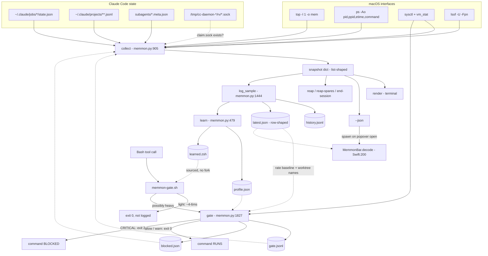

# memmon — Specification

**Status:** written retroactively from the code at `ce0b276`, then revised — see §0 for what has since been fixed. Originally produced (8 tracked files, 4,192 lines). This is the document that should have existed before the tool was built; it describes the system **as implemented**, not as intended. Every claim is anchored to `file:line`. Where the six source reviews disagreed, the disagreement is stated, not averaged. Every behavioural claim carries one of:

- **[VALIDATED]** — supported by empirical evidence in the repo or re-checked against the live install at `~/.claude/memmon/` while writing this.
- **[ASSERTED]** — implemented deliberately, with a stated rationale in a code comment, but never measured.
- **[DEFECT]** — the code does not do what the code's own docs/UI say it does.
- **[UNVALIDATED]** — plausible, untested, and the spec should say so rather than imply confidence.

---

---

## 0. Revision — what changed after this was written

This specification was produced by a nine-agent review of commit `ce0b276` and
described the system **as it was then**. An adversarial pass over that review
refuted 12 of its claims, confirmed 13, and found 7 more that no reviewer caught.
The confirmed findings were then fixed. So the sections below still describe the
architecture and the reasoning accurately, but several defects they record no
longer exist.

Rather than silently rewrite them, here is what changed. Where a section below
carries a **[DEFECT]** tag that appears in this table, treat it as history.

| Was | Now |
|---|---|
| The gate silently ungated real builds: the learned profile returned the verdict of the *first* matching command segment, so `python3 -c "…" && pnpm --filter web typecheck` evaluated as light | Learning is strictly additive — it can promote a command the regex misses, never demote one it catches |
| A gate-log row missing `ts` raised `KeyError` inside `collect()`, taking down `--once`, `--json`, `--reap`, the dashboard and the popover | Defaulted; the one path that failed *closed* now fails open like everything else |
| `--off 8h` never re-armed on a gate-only install, because only the sampler rewrote the flag | The gate repairs an expired pause itself |
| Learned shell patterns were neither deduped nor filtered; the token `.` was two observations from publishing `*.*` and routing every Bash call through Python | Tokens must be ≥3 chars, non-dot-leading, and unique |
| The advisory called a resident `node` dev server "build processes" and told sessions to `pnpm --filter` something unfilterable | Build fan-out and resident work are distinguished, and each gets advice it can act on |
| The verdict ranked only Claude's own worktrees, so it named a 2.3 GB build while a browser held 5.7 GB — more than every session combined — and never mentioned it | All memory is ranked: builds, resident processes and applications together |
| `read_vm` degraded silently to zeros when `top` failed, making `swap_frac` 1.0 and every per-process swap figure maximal — already present in 14 of 2,484 logged rows | Marks itself degraded instead |
| `--report`'s crisis metric tested `free_pct <= 15`, never once true in 2,487 samples | Reports the recorded verdict instead |
| The runway projected toward 10% headroom, a level never reached (minimum ever recorded: 18%), making every estimate optimistic | Targets 20%, the region stress actually reaches |
| The installer printed `export MEMMON_GATE=off` as the kill switch. Measured, it still costs ~52 ms per command — the variable is read *inside* Python — and cannot reach a hook spawned by an already-running Claude Code | `memmon --off` / `--on`, plus a Pause control in the popover; paused costs ~4 ms |
| The shell fast path fell back to globbing the entire hook payload when no `command` key was present | Exits instead |
| Uninstall deleted the hook script before patching `settings.json`, under `set -e` | Patches first |
| A missing `settings.json` aborted an otherwise-complete install with exit 1 | Skips the gate, finishes the rest |
| The README implied Activity Monitor reports memory incorrectly | Corrected: it does not. It shows footprint, the same figure this tool uses. The argument is attribution, not measurement |

Two things the review flagged that were **deliberately not changed**:

- **Non-Claude memory does not affect the score**, only the advice and the
  display. The score already reflects a browser through swap and headroom; adding
  a per-app term would double-count it. Revisiting this needs a replay against
  history, not an edit.
- **`--reap` still includes processes that are merely stale**, not only orphans.
  That is a policy question about what the button means, not a defect.


## 1. Problem

A 16 GB M1 running several concurrent Claude Code sessions froze. Not slowed — froze, losing work across every session at once. Three facts made the freeze both possible and undiagnosable with existing tools:

**1.1 Memory demand is invisible until it is fatal.** Two full-repo typechecks demanded ~34 GB simultaneously on a 16 GB machine (`README.md:6-7`). Each was started by a different session, and neither session knew the other existed. At the instant the second `pnpm typecheck` was launched the machine still looked fine, because `tsc` fan-out allocates over the following minutes.

**1.2 The standard instrument lies by a factor of ~25.** On Apple Silicon, once pages are compressed, `ps` RSS stops describing the process. A `tsc` process holding **3.5 GB** reported **133 MB** of RSS (`README.md:149-151`, `memmon.py:2-6`). Any tool built on RSS — including most scripts and most menu-bar monitors — will report a healthy machine during the exact event being investigated. The true figure lives in `top`'s `MEM` and `CMPRS` columns, which is what Activity Monitor shows.

**1.3 The memory cannot be attributed to a responsible party.** To a process monitor, N Claude sessions are N identical `node` processes:

- A session claimed from Claude Code's prewarm pool keeps the pool's `claude bg-spare …` command line forever and never acquires a `--session-id` (`memmon.py:765-770`). Command-line parsing found **1 of 7** live sessions; the daemon rendezvous socket found the rest (`README.md:173-176`).
- Subagents have no pid at all — they execute inside the parent process (`memmon.py:725-727`), so no process monitor can see them.
- A build whose parent shell died is reparented to launchd and nothing will ever clean it up. One such orphan was holding **3.5 GB** (`README.md:156-157`).
- Naïvely counting the prewarm pool reported "14 idle prewarms holding 2.7 GB" when the truth was "2 idle prewarms holding 186 MB, plus six working sessions, one of them 22 hours old" (`README.md:178-183`). Acting on the naïve count would have killed six live sessions.

**1.4 Nothing can tell a session to stop.** Even with perfect measurement, the actor that must change behaviour is an autonomous agent that is about to run `pnpm typecheck`. No monitor can reach it. Claude Code's `PreToolUse` hook can.

**The problem, stated once:** on a memory-constrained Mac running concurrent agentic sessions, there is no instrument that measures true memory, attributes it to a named responsible session, distinguishes reclaimable waste from live work, or reaches the actor whose next decision determines whether the machine survives.

---

## 2. Goals and non-goals

### 2.1 Goals

| # | Goal | Success test |
|---|---|---|
| G1 | Report **true** per-process memory, RAM/swap split | Figures agree with Activity Monitor, not with `ps` |
| G2 | Attribute memory to a **named** session and its current task | Every live session appears by name, including prewarm-claimed ones |
| G3 | Attribute build memory to a **worktree** | A 12-process `tsc` fan-out reads as one row |
| G4 | Identify memory that is **safe to reclaim** and never misclassify live work as reclaimable | Zero live sessions killed, ever |
| G5 | Predict the freeze **before** it happens, with a stated reason | Scored replay of a real near-freeze separates crisis from calm |
| G6 | Give a session enough context to **self-regulate** | Advisory names the offending worktree, not generic advice |
| G7 | Never be the reason work stops | Every non-`CRITICAL` path exits 0; every error path exits 0 |
| G8 | Cost nothing on the machine it monitors | Light Bash calls never start Python; menu bar never spawns on a timer |
| G9 | Install and uninstall without residue or surprise | Idempotent, backed up, preserves foreign hooks |

### 2.2 Non-goals (explicit)

- **NG1 — Not a general system monitor.** For a plain RAM/swap readout, `README.md:145-146` points users at Stats. memmon exists only for what a general monitor structurally cannot do.
- **NG2 — Not a scheduler or an admission controller.** It never queues, delays, or serialises work automatically. `--wait-safe` (`memmon.py:1957-1971`) exists only as an explicit primitive an agent may choose to call.
- **NG3 — Not automatic remediation.** Nothing is ever killed without an explicit `--apply` or a menu-bar confirmation. The launchd sampler only ever runs `--log` (`install.sh:110`).
- **NG4 — Not cross-machine.** No network, no telemetry, no aggregation (`README.md:340`).
- **NG5 — Not a blanket blocker.** The design position is that a session knows which of *its* workloads is expendable and the gate does not (`README.md:74-76`). Blocking is the last resort, at one tier only.
- **NG6 — Not a supported product.** Single user, single machine, no versioning, no tests in the repo (`git ls-files` returns 8 files, none of them tests).
- **NG7 — Not portable off macOS.** `install.sh:67-68` refuses anything but Darwin.

---

## 3. Users and environment

**Primary user:** one engineer running 5–12 concurrent Claude Code sessions on a 16 GB Apple Silicon MacBook.

**Secondary user (equal weight, and this shapes the design):** the *Claude sessions themselves*. They read the gate's `additionalContext`, they read `memmon --once` output when told to, and they can be told to install the tool (`CLAUDE.md` is written for an agent installer, `README.md:103-105`). Consequences: output must be parseable and non-misleading to a model, and anything printed to a dashboard an agent reads is effectively a suggested command — including `→ memmon --reap --apply   free it now` (`memmon.py:1357`), which is a destructive one.

**Assumed environment:**

| Assumption | Where enforced | Failure if violated |
|---|---|---|
| macOS 13+ | `install.sh:69-73` | refused at install |
| `/usr/bin/python3` (Xcode CLT) | `install.sh:74-75` — existence only | **[DEFECT]** the CLT `xcrun` stub satisfies `-x` and exits 1 at runtime |
| `swiftc` for `--menubar` | `install.sh:127` | refused |
| `~/.claude/` present | `install.sh:76-79` (warning only) | attribution + gate inert; RAM/swap still works |
| Apple Silicon page size 16384 | **not** assumed — read at runtime (`memmon.py:247-252`) | — |
| ~16 GB RAM | **assumed and hardcoded** — see §10.7 | scoring and learning both degrade on 64 GB |
| zsh available for the hook | `memmon-gate.sh:1` | hook errors on every Bash call |
| No sudo, no TCC permissions | by construction (`CLAUDE.md:68-82`) | — |

---

## 4. Functional specification

### 4.1 Measurement

**4.1.1 Per-process memory.** `read_top` (`memmon.py:114-137`) runs `top -l 1 -n 300 -o mem -stats pid,mem,cmprs` and returns both the parsed table **and the raw header block**, so `read_vm` can re-parse PhysMem/Load from it instead of spawning a second `top -l 1 -n 0` (measured ~445 ms, `memmon.py:117-119`). `MEM` is the footprint; `CMPRS` is how much of it is compressed.

**4.1.2 Per-process swap is an estimate, and is labelled as one.** macOS exposes no per-process swap counter (`memmon.py:224-228`). memmon computes a system-wide `swap_frac = swap_used / (compressor + swap_used)` and attributes `swapped(pid) = min(cmprs(pid) * frac, mem(pid))` (`memmon.py:920-927`), capped so `ram + swap == mem` always. RSS is explicitly rejected as the RAM half because RSS counts shared pages the footprint excludes, so the two columns would not sum (`memmon.py:929-936`). The terminal labels the column `SWAP~` (`memmon.py:1272`, `:1363`). **[DEFECT]** the popover prints `SWAP 3.9G` unadorned (`MemmonBar.swift:505`) and describes the derived outline as measured fact (`MemmonBar.swift:441`).

**4.1.3 System memory, two fidelities.** `read_vm(fast=False)` (~400 ms, uses the `top` header) for the dashboard; `read_vm(fast=True)` (~10 ms, `sysctl` + `vm_stat` + `os.getloadavg`) for the gate (`memmon.py:171-229`). Fast mode omits `ram_used`, `wired`, `compressor`, `unused` and sets `nprocs = 0`. **[DEFECT]** `swap_frac` is still computed at `:226-228` with `compressor = 0`, so it is **1.0** in fast mode. No consumer in the gate path reads it today; there is no `vm["fast"]` marker to prevent one from doing so.

**4.1.4 Page size is read, not assumed.** `_page_size()` (`memmon.py:247-252`) parses `vm_stat`'s first line. Hardcoding 16384 would overstate every paging rate 4× on Intel, tripping DANGER at a quarter of the real thrash (`memmon.py:232-236`). **[VALIDATED]** by reasoning, not by an Intel trace — see §10.

### 4.2 Attribution

**4.2.1 pid → session.** Two links, unioned (`memmon.py:938-948`):
1. `lsof -U -Fpn` → `/rv/<8-hex>.sock` → job short id (`map_pids_to_jobs`, `memmon.py:765-784`). **Primary.**
2. `--session-id <uuid>` in the command line (`SESSION_ID_RE`, `memmon.py:46`). **Fallback**, for terminal sessions.

Sessions with a job state file are read from `~/.claude/jobs/<short>/state.json` (`read_sessions`, `:595-638`); terminal sessions are reconstructed from `~/.claude/projects/<key>/<sid>.jsonl` (`:950-969`).

**4.2.2 Session → subtree.** Once the root pid is known, the whole descendant tree is claimed (`:999-1000`), which is what makes a `codex → pnpm → turbo → tsc` chain roll up to the session that asked for it. Children under 80 MB are dropped from display (`:1005`), top 4 shown (`:1024`).

**4.2.3 Subagents.** Read from `<transcript>/subagents/*.meta.json` sidecars — agent type, description, model — without opening the multi-MB transcript (`read_subagents`, `:725-758`). Active = mtime within 180 s.

**4.2.4 Services.** Every `Bash` `tool_use` in a transcript tail is matched against `SERVICE_CMDS` (`:646-653`) to answer "which session started Docker / this dev server" (`:971-987`).

**4.2.5 Worktree roll-up.** By configured `project_roots` (preferred, needs no naming convention) else by `worktree_pattern` regex (`worktree_of`, `:874-889`). **Deliberate exclusion, with a consequence:** the roll-up skips every pid inside a live session subtree (`:1116-1118`). `snap["worktrees"]` is therefore *by construction* only build memory that no live session owns. **[DEFECT]** `build_advice` (`:565`) and `gate_decision` (`:1693`) both name the offender exclusively from that set, so the motivating scenario — a live session's typecheck eating the machine — cannot be named by either. The README's showcase line (`README.md:14`) is only producible when the `tsc` processes are *unattributable*, which is the case the rest of the tool works hardest to eliminate.

**4.2.6 Everything else.** Known apps by a 12-needle list (`app_group`, `:892-902`); unattributed single processes ≥300 MB (`:1104-1108`); Claude's own runtime pool — spares, pty hosts, daemon (`:1066-1098`).

### 4.3 Reclaimable-memory detection

**Orphans / runaways** (`:1030-1050`). A pid is a target iff **all** of: not in a live session subtree; `mem ≥ 100 MB`; command matches `REAPABLE` (`:42-45` — `tsc`, `turbo`, `esbuild`, `jest-worker`, `vitest`, `next-server`, `webpack`); and (`ppid == 1` **OR** `age ≥ 3600`).

That last disjunction defines two classes with very different safety properties, and only the first matches the documentation:

- `[orphan]` — parent dead, reparented to launchd. Nothing will ever clean it up.
- `[stale]` — **parent alive**, merely older than one hour. A `next dev`, a `vitest --watch`, a `turbo watch dev`, or any full-repo build that has run longer than an hour.

The terminal dry-run distinguishes them per row (`:1348`, `:1614`). **[DEFECT]** `README.md:48-49`, `README.md:156`, and `MemmonBar.swift:937` all describe every target as "orphaned build processes whose parent died".

**Idle prewarms** (`:1083-1097`, `reap_spares` `:1571-1602`). Idle iff a `.claim.sock` path is present in the command line **and** that file exists (`spare_is_idle`, `:787-794`). Only spares idle > 4 h are targeted. Claimed processes are excluded unconditionally *and reported* as "N claimed session(s) holding X — working, not reclaimable" (`:1583-1584`).

**Deliberately not done:** memmon never reaps automatically, never reaps on a schedule, and never kills anything inside a live session subtree.

### 4.4 Crash-risk scoring

`pressure(vm)` (`:256-381`) returns `{level, color, score, reasons[], headroom_min, next_level, to_next, lh_streak, thrash_mbs, + 4 rates}`.

| Signal | Bands | Points | Source |
|---|---|---|---|
| swap ÷ **RAM size** | ≥1.0 / ≥0.5 / ≥0.25 | +4 / +2 / +1 | static |
| swapin + swapout MB/s | ≥150 / ≥50 / ≥10 | +4 / +2 / +1 | **rate** |
| free memory % | ≤12 / ≤20 | +3 / +2 | static |
| swap growth MB/min | ≥500 / ≥150 | +2 / +1 | **rate** |
| load ÷ cores | ≥3 / ≥1.75 | +2 / +1 | static |

Tiers: `≥7 CRITICAL`, `≥4 DANGER`, `≥2 WATCH`, else `HEALTHY` (`:348-355`). Max 15. `to_next` is always reported so a bare score is readable.

**Headroom** is a straight-line projection of when `free_pct` reaches 10% (`:342-346`). It may promote WATCH→DANGER only after **two consecutive** low readings, and when it does the reason is appended to the card (`:356-367`) — because the underlying signal is the weakest in the table and "a DANGER whose listed reasons only add up to WATCH is worse than no warning".

**Rate signals require a previous sample.** In a one-shot process there is none, so `_prev_vm` is seeded from `latest.json` if it is 5–300 s old *and* contains `swapins` (`:266-276`). If not, all four rates are silently 0.0 and nothing in `reasons` says so. This is the single most consequential structural property of the gate — see §10.1.

### 4.5 The gate

**Two-stage pipeline.** Stage 1 is `memmon-gate.sh`, zsh, no fork: read stdin with the builtin (`:16`), extract the command substring (`:23`), source `learned.zsh` (`:32`), exit if paused (`:36`), and `case`-match a deliberately **broad superset** of the Python matcher (`:38-44`). Stage 2 is `python3 memmon.py --gate`, which does the precise match and the pressure read.

**Documented costs are inconsistent across five surfaces** — 4 ms (`memmon.py:2131`), 6 ms (`MemmonBar.swift:850`, `README.md:298`), 45 ms Python startup (`memmon-gate.sh:4`), 57 ms (`README.md:246`), 72 ms (`README.md:300`), 85 ms budget (`memmon.py:28`). Only `gate.jsonl`'s `ms` field is measured, and it is measured end-to-end from a zsh-stamped `MEMMON_T0` (`memmon-gate.sh:48-49`, read at `memmon.py:1833`) so it includes interpreter startup.

**Decision** (`gate_decision`, `:1677-1716` — a pure function, testable without provoking a real crisis):

```
mode==off | tool!=Bash | !is_heavy      -> allow, silent
level==HEALTHY                          -> allow, silent
WATCH / DANGER                          -> warn
CRITICAL  (mode block-critical|block)   -> block
DANGER    (mode block)                  -> block
anything unrecognised                   -> warn      (never block)
```

**What each action does to the session:**
- **allow** → exit 0, silent, logged.
- **warn** → exit 0 **and the command runs**; the message is injected as `hookSpecificOutput.additionalContext` (`:1888-1897`). A comment records that plain stdout was verified *not* to reach the model. The advisory therefore shapes the session's *next* decision, never the current one.
- **block** → exit 2 with the message on stderr, recorded in `blocked.json` (`:1880-1886`). Exit 2 is the only code that stops a tool.

**Message content** (`:1690-1715`): level + reasons; the top-2 worktrees over 2 GB by name from `latest.json`; headroom if under 30 min; and either a scoping suggestion or a refusal that names `pnpm --filter <package>` as the alternative.

**Heaviness** (`is_heavy`, `:1665-1674`): learned profile **first**, hand-written `HEAVY_CMD` regex second, and the learned verdict — including a learned *light* verdict — is returned authoritatively.

**Deliberately not done:** the gate does not compare a command's *predicted* cost against available headroom, even though `profile.json` holds exactly that number in the same process. See §10.2.

### 4.6 Learning

The 1/min sampler calls `learn(snap)` (`:479-512`) inside `log_sample`. For each session whose `doing` matches `[shell] <command>`, `normalise_cmd` reduces the line to up to 4 comparable *shapes* (`:419-455`), and each shape's `peak` is set to `max(peak, session_subtree_total)` (`:497`). A shape is "heavy" at `n ≥ 2` and `peak ≥ 1500 MB` (`:393-395`). Heavy shapes are published to `learned.zsh` as `*<first-token>*` globs (`:541`) so the shell fast path stops filtering them out.

Rationale (`:479-486`, `:1666-1670`): the regex only ever encoded JavaScript-monorepo tooling and cannot know that `codex.sh run` on this machine spawns a multi-GB build. Attribution uses the session's **own subtree**, never a system-wide delta, so ten concurrent sessions cannot blame each other. Anything finishing inside a minute is never learned — correct for learning, since such a command is not the problem.

**As shipped this subsystem is net-negative.** Verified on the live install while writing this spec:

```
MEMMON_LEARNED='*codex.sh*|*npx*|*pnpm*'

'npx check'        n=4   peak 5085 MB
'codex.sh run'     n=19  peak 3959 MB
'p…'               n=1   peak 3255 MB     <- truncation fragment
'pnpm test'        n=11  peak 2736 MB
'Found'            n=1   peak 2254 MB     <- not a command
'python3 import'   n=24  peak  750 MB
'…'                n=8   peak  736 MB
'e…'               n=6   peak  708 MB
'tmux kill-session' n=2  peak  698 MB
```

Three independent causes, all confirmed in code: `doing` is truncated to 149 chars + `…` before the learner ever sees it (`:620-621`); `peak` is the session's **absolute** footprint, not the command's cost, and a Claude session routinely exceeds the 1.5 GB threshold before running anything (`:497`); and the published glob keeps only the shape's first token (`:541`), so `npx check` and `pnpm test` widened the fast path to `*npx*|*pnpm*` — every `npx` and every `pnpm` invocation on this machine now pays a Python spawn.

### 4.7 Front ends

**Terminal** — live dashboard (alternate screen, in-place repaint, 4 s default), `--once`, `--json`, `--statusline`, `--pressure` (fast, no `top`, exit code 0 for HEALTHY/WATCH and 1 otherwise — useful for scripting, undocumented in the README), `--report`, `--blocked`, `--gate-log`, `--profile`, `--reap`, `--reap-spares`, `--end-session`, `--wait-safe`, `--off/--on`, `--clear-gate-log`, `--clear-blocked`, `--log`. The renderer **sheds detail tiers** rather than truncating when the window is short (`:1408-1425`).

**Menu bar** — a deliberately thin shell over the CLI (`MemmonBar.swift:3-5`). The title refreshes from `latest.json` on a 60 s timer (a file read, never a spawn, `:1007-1009`); `memmon --json` runs **only** when the popover opens (`:1018`). `--render out.png` draws the popover offscreen with a DANGER fixture so states that cannot be reproduced on demand are still design-reviewable (`:1086-1167`).

**Gate messages** — the third front end, and the only one that changes anyone's behaviour.

---

## 5. Architecture

### 5.1 Components

| Component | Language | Lifetime | Trigger |
|---|---|---|---|
| CLI / library | Python 3, stdlib only, one file | one-shot, or a 4 s loop | user |
| Sampler | same file, `--log` | 60 s, launchd, `Nice 10`, `LowPriorityIO` | `install.sh:97-124` |
| Gate stage 1 | zsh | per Bash tool call | `PreToolUse` hook |
| Gate stage 2 | same Python file, `--gate` | only if stage 1 falls through | `memmon-gate.sh:51` |
| Menu bar | Swift/SwiftUI, `LSUIElement` | login → quit | launchd `RunAtLoad` |

The Python file is one 2,255-line module on purpose: `install.sh:84` copies **one file**, and the lazy-import discipline (`memmon.py:26-28`, `:1216`, `:1575`, `:1981`) exists because it must cold-start in the gate's budget. Splitting it into a package would break both.

### 5.2 Data flow



Two facts the diagram makes visible that neither `README.md` nor `CLAUDE.md` states:

1. **`collect()` depends on the gate.** `:1145-1146` folds `load_pending()` and `gate_stats()` into the system snapshot, closing a filesystem loop (`collect → gate_stats → gate.jsonl ← gate → latest.json ← log_sample ← collect`). There is no way to obtain a pure "what is the machine doing" snapshot, and any test of `collect()` needs gate fixtures.
2. **The gate depends on the sampler.** `latest.json` is written only by `log_sample` (`:1489`). Without it the gate loses all four rate signals *and* its ability to name an offender. `CLAUDE.md:12` — "Four independent pieces" — is false in this direction.

### 5.3 The Python ↔ Swift contract

There are **two** JSON shapes, and they share three key names with incompatible types. This is the least documented and most fragile interface in the system.

| key | `--json` snapshot (`:1141-1156`) | `latest.json` / history row (`:1447-1463`) |
|---|---|---|
| `pressure` | dict `{level, score, reasons, advice, …}` | **string** `"DANGER"` |
| `sessions` | list of dicts | **dict** `{name: bytes}` |
| `worktrees` | list of dicts | **dict** `{"build:name": bytes}` |

Four consumers depend on the row shape and would fail *silently*, not loudly, if the two were "unified": `updateTitleFromCache` (`Swift:1030`, `as? String` fails → permanent green dot), `--statusline` (`:2176`), `gate_decision`'s worktree naming (`:1693`, `.items()` on a list raises → gate falls open), and `pressure()`'s baseline seeding (`:270-275`, which guards only on `swapins`, not `swapouts`/`free_pct`/`swap_used` — dropping `swapouts` would halve every thrash reading with no error anywhere).

**Neither shape carries a schema version.** The Swift decoder is total-defaulting (`Swift:200-297`, every field `as? T ?? default`), so a renamed producer field renders a confident, plausible lie — e.g. renaming `top_children` makes every session say "no spawned work — the session process is all of it" (`Swift:556-558`). And the two halves do not ship together: `install.sh:84` copies `memmon.py` on **every** run, while the app is recompiled only when `--menubar` is passed (`:126-133`).

**Presentation knowledge duplicated across the boundary**, including in the two constants that exist to prevent exactly that:

- `STATE_COLOR`/`STATE_LABEL` (`memmon.py:241-244`) carry a comment recording that "the terminal previously painted working green and done grey — the exact inverse of the menu bar, for the same session". Swift re-implements the mapping independently at `Swift:76-94`.
- `SERVICE_ALIAS` (`memmon.py:386`) says folding Docker/Docker VM here "means the terminal and the popover agree without either knowing the special case". `Swift:226-227` hardcodes the same special case.
- Tier boundaries `0/2/4/7` exist in four places: `memmon.py:348-353`, `:371`, `Swift:580-581`, `README.md:197`.
- `human`/`dur` reimplemented at `Swift:17-27`; hot-session threshold 50% at `:1281`/`Swift:469`; worktree red threshold 6 GB at `:1366`/`Swift:948`.

### 5.4 Hook integration

`install.sh:182-199` appends one entry to `hooks.PreToolUse` with `matcher: "Bash"`, backing up `settings.json` first (`:181`) and refusing to stack duplicates by scanning for the substring `memmon-gate` in any existing hook command (`:189-193`). Uninstall uses the *same* predicate (`:51-53`), so install and uninstall cannot disagree about what belongs to memmon. Verified against a live `settings.json` containing an unrelated third-party hook: untouched.

No `timeout` is set on the hook entry (`:194-195`). Nothing pins the gate's worst case; `_sh` caps subprocesses at 15 s (`memmon.py:88`) and the gate path never calls `top`, but the bound is incidental.

---

## 6. Key design decisions

Each: **decision → alternatives rejected → why → evidence.**

### D1. Read `top`'s MEM/CMPRS; never `ps` RSS
**Rejected:** `ps -o rss`, `psutil`, `task_info`. **Why:** RSS under-reports ~25× once pages compress; a 3.5 GB `tsc` shows 133 MB. **Evidence:** [VALIDATED] the founding observation (`README.md:149-151`, `memmon.py:2-6`); reproducible on any Apple Silicon machine under swap. **Cost accepted:** ~400 ms per snapshot, which forced D5.

### D2. Score pressure on swap-vs-**RAM size**, not swap-vs-swapfile and not `kern.memorystatus_level`
**Rejected:** (a) swap used ÷ swap total — macOS grows the swapfile on demand, so this sits near 100% on an idle machine and reported CRITICAL while nothing was wrong (`memmon.py:1220-1222`); (b) `kern.memorystatus_level` — measured **28% both mid-crisis and idle** (`README.md:211`, `memmon.py:321-322`), so free-% is demoted to a weak term scoring only below 20%. **Why:** the freeze comes from jetsam deciding pageout cannot keep up with allocation; swap-vs-RAM discriminated 1.1–1.4× (crisis) from 0.15× (idle) (`:299-302`). **Evidence:** [VALIDATED] — 929-sample replay of a real near-freeze: crisis **DANGER 78% · CRITICAL 6% · WATCH 15% · HEALTHY 0%**; calm **HEALTHY 99%** (`README.md:213-219`). The first scoring attempt reported HEALTHY *during* the crisis; the replay is what caught it and why swap-vs-RAM was promoted (`README.md:221-222`). **Caveat:** the replay harness is not in the repo, `pressure()` is not a pure function (it mutates the `_prev_vm` global and reads `latest.json` as a side effect, `:264-276`), and neither `score` nor `reasons` is persisted to history (`:1447-1463`) — so **the headline validation cannot be re-run by anyone reading this repo, and cannot be re-run after a scoring change.**

### D3. `lsof -U` → rendezvous socket as the primary pid→session link
**Rejected:** parsing `--session-id` from command lines (kept only as fallback). **Why:** a session claimed from the prewarm pool keeps the pool's `bg-spare` command line forever and never gains a `--session-id`. **Evidence:** [VALIDATED] six of seven live sessions were invisible to command-line parsing (`README.md:173-176`); independently re-confirmed by one reviewer against the live socket table. **Cost:** an `lsof` over every unix socket on the machine, 20 s timeout (`:771`).

### D4. `.claim.sock` presence is the idle/claimed discriminator, and ambiguity resolves to "live"
**Rejected:** treating every `bg-spare` process as idle. **Why:** the socket is deleted when a session claims a spare, but *the command line does not change*. Getting this backwards kills live sessions. `spare_is_idle` returns `False` when the regex finds nothing at all (`:787-794`) — unknown means not-idle means never-killed. **Evidence:** [VALIDATED] before the check, the pool read as "14 idle prewarms holding 2.7 GB"; the truth was 2 idle prewarms holding 186 MB plus six working sessions, one 22 hours old (`README.md:178-183`). One reviewer re-verified against an independent ground truth (which pids hold `/rv/*.sock`): 9 of 9 correct, 8 claimed sessions excluded and reported, 2 genuine spares offered. **This is the best-defended thing in the codebase**, and correctly so: it is the only discriminator whose inversion destroys a day of work.

### D5. Two-fidelity `read_vm`
**Rejected:** one collector for both callers. **Why:** `top` costs ~400 ms and the gate runs on every Bash tool call; everything the pressure model needs is in `sysctl` + `vm_stat` in ~10 ms (`:171-178`). **Evidence:** [ASSERTED] with measured numbers in the comment. **Residual:** the fast dict is partially wrong with no marker (§4.1.3).

### D6. Shell fast path filters; Python decides
**Rejected:** running Python on every Bash call; matching the whole hook payload. **Why:** ~45 ms of interpreter startup to decide `git status` is harmless is not acceptable; and globbing the whole payload made any command under a worktree named `…-Rebuild-Cache` spawn Python — measured 55 ms vs 7 ms, and invisible because Python then rejects it *before anything is logged* (`memmon-gate.sh:18-22`). The shell globs are a deliberately **broad superset**: over-matching costs one Python start, under-matching silently disables the gate (`:5-9`). **Evidence:** [VALIDATED] the failure that motivated the fix is documented with its measurement. **Two defects survive the fix:** (a) `cmd=${input#*\"command\":}` strips only the *prefix*, so the model-written `description` field is still globbed — descriptions say "build"/"test"/"install" constantly, and those calls pay full price then get rejected at `:1843` **without a log row**, making the cost unfalsifiable from the tool's own instrumentation; (b) the superset invariant is already violated — `\bmake\b` is in `HEAVY_CMD` (`:1661`) but no glob in `memmon-gate.sh:40-42` matches a bare `make`, so Makefile builds are ungated *and indistinguishable in `--gate-log` from "nothing heavy ran"*.

### D7. Warn by context injection; block only at CRITICAL; fail open on everything
**Rejected:** blanket blocking; printing to stdout; failing closed on error. **Why:** the gate cannot know a dev server matters less than a test run — only the session knows. Exit 2 is the only code that stops a tool; every other path, **including every error path**, returns 0 (`:1899-1912`), and each failure writes an `action:"error"` row so `gate_stats.healthy` (`:1778`) can distinguish "broken for a day" from "quiet machine". `additionalContext` was chosen after verifying plain stdout does not reach the model (`:1889-1892`). **Evidence:** [VALIDATED] two recorded outcomes, both from *allowed* commands (`README.md:60-93`): one session received a DANGER advisory and killed its own dev server 48 s later to protect a test run — swap fell 2.1 GB, load 20→3; another turned a full E2E run into a three-option question for the human. **A blanket block could not have produced either.**

### D8. Refusals are queued and auto-cleared
**Rejected:** refusing and forgetting. **Why:** a blocked command that nobody re-runs is lost work. `record_block` dedupes on `(cmd, session_id)` (`:1804-1814`); `clear_pending` fires when the same session re-runs the same command and is allowed (`:1817-1824`); a notification fires once per sustained recovery — five unbroken HEALTHY samples, a command blocked within four hours still waiting, and a two-hour cooldown, all silenceable with `notify: never`. **Evidence:** [ASSERTED]. **Known incompleteness:** exact-string match only, no TTL — a session that re-runs the *scoped* variant the block message recommended never clears the original.

### D9. Learn what commands cost on *this* machine
**Rejected:** relying on the hand-written regex alone. **Why:** `HEAVY_CMD` encodes one ecosystem's tooling and cannot know about `codex.sh run` or any local wrapper (`:1666-1670`). Attribution deliberately uses the session's own subtree, never a system-wide delta (`:479-486`). **Evidence:** [VALIDATED] as a *motivation* — `codex.sh run` at 3.96 GB, n=19, is real and the regex would never have found it. [DEFECT] as an *implementation* — see §4.6. **The reviews disagree on the remedy:** the problem-fit review argues the layer is net-negative as a boolean filter and should either be wired into a predictive comparison or removed; ops and safety argue for repair (delta-based attribution, executable sanitisation, whole-shape globs, a `--forget` command); UX argues the missing piece is visibility. They do not disagree that it is currently broken.

### D10. Single-file stdlib Python; Swift as a thin shell
**Rejected:** a package; a Swift-native collector; a background daemon. **Why:** `install.sh` copies one file and the source may live in a git worktree that gets deleted (`install.sh:82-83`); nothing is pip-installed; the menu bar must not do background work on the machine it is monitoring (`Swift:3-5`). **Evidence:** [ASSERTED], and the constraint holds — the popover spawns exactly one process, on open. **Cost:** every safety check lives in the CLI, so menu-bar actions block the main thread for the duration of a full `collect()` plus a 2 s sleep (`Swift:1060`, `:1073`; `memmon.py:1630`, `:1943`) — roughly four seconds of frozen popover with no indication.

### D11. Copy, not symlink; pin `/usr/bin/python3`
**Rejected:** symlinking the repo; `#!/usr/bin/env python3`. **Why:** the source may be deleted; a pyenv/homebrew shim change must not break the monitor (`install.sh:92`, `memmon-gate.sh:51`, `Swift:165`). **Evidence:** [ASSERTED], and correct — this is the failure mode most install scripts get wrong. **Gap:** `MemmonBar.swift` is *not* copied into `DEST_DIR` (only `memmon.py`, `memmon-gate.sh`, `README.md`), so the installed tree cannot rebuild its own app after the source worktree is deleted — the exact scenario the decision exists to defend against.

### D12. Trim history by row count, never by age
**Rejected:** an age cutoff. **Why:** an age cutoff further out than the size gate removes nothing once the gate is reached, so the sampler rewrites the whole file every minute and it never shrinks. **That bug shipped once** (`memmon.py:1494-1498`, `README.md:334-336`). **Evidence:** [VALIDATED] by the incident, and the arithmetic holds — measured 731 B/row on the live install (1,800,606 B ÷ 2,463 rows) against a 1,248 B/row budget, a 1.7× margin.

### D13. Destructive operations validate identity, default to dry-run, and use SIGTERM
**Rejected:** killing by pid without re-validation; SIGKILL; apply-by-default. **Why:** the caller passes a number and a stale or mistyped one must never kill an arbitrary process. `end_session` refuses any pid that is not currently a session **root** in a freshly collected snapshot, and prints the live roots so the user can correct themselves (`:1915-1928`). SIGTERM only, so the session flushes its transcript. The Swift confirmation names the process count and footprint, states plainly that unsaved work is lost, and puts Cancel as the **default** button (`Swift:1045-1062`). **Evidence:** [ASSERTED]; adversarially checked by one reviewer (`--end-session -1` refused; pid 0 unreachable because `if args.end_session:` is false for 0). **Not applied consistently:** the Reap alert makes destruction the default button and shows no target list (`Swift:1064-1075`); `reap`/`reap_spares` never re-validate a pid between the snapshot and the signal, and the SIGKILL sweep re-checks *existence*, not identity (`:1631-1636`).

### D14. One reader per computed metric
**Rejected:** independent tallies per front end. **Why:** the CLI and the menu bar had two implementations of the gate summary and **had already drifted** — one excluded error rows from the latency sample, the other did not, so they reported different p50s for the same file, *diverging exactly when the gate was failing* (`:2108-2112`). `_read_gate_rows`/`gate_stats` are now the single reader (`:1732-1785`). **Evidence:** [VALIDATED] by the observed divergence. **Note:** the same instinct was not applied to `STATE_COLOR` or `SERVICE_ALIAS`, both of which are duplicated in Swift despite comments saying they exist to prevent duplication.

---

## 7. Data model and retention

Everything lives in `~/.claude/memmon/`. Nothing is written to `/tmp` (`README.md:325`). No file has a schema version. Files are created with the process umask (0644) in `$HOME`.

| File | Written by | Shape | Bound | Actual lifetime | On corrupt/absent | Concurrent writers |
|---|---|---|---|---|---|---|
| `history.jsonl` | `log_sample` (`:1487`) — sampler **and** every live dashboard (`:2222`) | one flat row/sample, 15 keys | trim to last **10,080 rows** once size > **12 MB** (`:1499-1511`) | ~11 days at 1/min, then cut to 7; **halved with a dashboard open** | per-line `try` drops bad rows (`:1534`) | **yes** |
| `latest.json` | `log_sample` (`:1489`) | **one history row**, not a snapshot | fixed, 1 row | until next sample | all four readers swallow | **yes** |
| `gate.jsonl` | `gate()` (`:1861`), error rows (`:1904`) | ts, cmd[:200], mode, level, action, session[:8], cwd, reasons[], ms | tail-500 once > 256 KB (`:1872`) | ~500 heavy commands | unparseable lines dropped (`:1743`) | **yes — every session** |
| `blocked.json` | `save_pending` (`:1796`) | list of {ts, session_id, session, cmd **untruncated**, cwd, level} | last 50 | **forever** — no TTL, exact-match clear only | `[]` (`:1788`) | **yes** |
| `profile.json` | `learn()` (`:505-509`) | `{shape: {n, peak, last}}` | 30-day expiry on `last`, **only pruned when a learn cycle changes something** | indefinite for recurring shapes | `{}` (`:458`) | yes |
| `learned.zsh` | `_write_learned_glob` (`:543-554`), `--off`, `--on` | 2 zsh vars | fixed | until next write | sourced; defaults pre-set (`memmon-gate.sh:30-31`) | yes |
| `paused.json` | `--off` (`:2035`), removed by `--on` | `{"until": epoch\|"forever"}` | fixed | until `--on` or expiry | `pause_until` → 0 → **gate active** (fail-safe) | no |
| `config.json` | user | 3 keys (`:53-59`) | n/a | permanent | all swallowed; bad regex falls back (`:75-80`) | no |
| `sampler.err` | launchd (`install.sh:117`) | raw stderr | tail-200 past 1 MB — **but see below** | unbounded in practice | never read by any code | launchd |

**Outside the state directory:** `~/.local/bin/memmon` (3-line wrapper), `~/.claude/memmon/{memmon.py, memmon-gate.sh, README.md, MemmonBar.app}`, `~/Library/LaunchAgents/dev.memmon.sampler{,bar}.plist`, one `PreToolUse` entry in `~/.claude/settings.json`, and one **timestamped backup of `settings.json` per install invocation** (`install.sh:44`, `:181`) — including on the idempotent no-op path, so these accumulate without bound.

**Retention defects:**

- **[DEFECT] `sampler.err` is not independently bounded.** The stderr trim at `:1515-1523` sits *after* the early `return` at `:1507`, so it executes only when `history.jsonl` is already over 12 MB. Compounding it, `_trim_history()` runs only at the end of a *successful* `log_sample` — the file that grows when the sampler is failing is bounded by a code path that runs only when it succeeds. `README.md:332` promises "last 200 lines past 1 MB". (Live file is currently 0 bytes, so this has never bitten.)
- **[DEFECT] both trims rewrite in place** (`:1508-1511`, `:1872-1876`): read-all → truncate → write. A crash, a jetsam kill, or a `--reap --apply` SIGKILL between truncate and write loses the entire file — on a machine whose defining characteristic is that it gets processes killed. Every other state file uses tmp + `os.replace`.
- **[DEFECT] `latest.json` is the only hot file written non-atomically** (`:1489-1490`), ten lines after `save_pending` does it correctly. A torn read is swallowed at `:275`, leaving `_prev_vm` empty — which zeroes all four rate signals with no trace.
- **[DEFECT] `save_pending` shares one temp path across all writers** (`:1798`). Two concurrent sessions: A's `os.replace` consumes the temp file, B's raises `FileNotFoundError`. In `gate()` that exception is inside the outer try, so a **decision to block becomes an allow** — after the `action:"block"` row has already been written to `gate.jsonl`. The audit trail then asserts the opposite of what happened. The same shared-tmp pattern is used for `profile.json` (`:506`) and `learned.zsh` (`:543`).
- **[DEFECT] history rows discard what the tool's own analysis needs**: no `score`, no `reasons`, no per-session RAM/swap split, no session id, no `ncpu`/`ram_total`, no schema version, no cadence marker. Sessions are keyed by *name*, and names fall back to the first five words of the prompt until the daemon names the session (`:624-627`), so one session lands under several owners and `--report`'s SEEN% splits across them.
- **Cadence is unrecorded and uncoordinated.** The live file spans two eras at different rates; `report()` computes SEEN as a share of raw rows (`:1565`), so a dense hour outweighs a sparse day.

**Privacy.** Commands are stored raw. `gate.jsonl` truncates at 200 chars; `blocked.json` does **not** truncate at all. Neither strips leading `VAR=value` preambles, although `read_sessions` does exactly that for display (`:619`) — so `AWS_SECRET_ACCESS_KEY=… pnpm build` is persisted verbatim, world-readable. `install.sh:61` names only `history.jsonl` as retained on uninstall; the two files holding raw commands are not mentioned.

---

## 8. Safety model

### 8.1 What can destroy work

| Capability | Signal | Blast radius | Guard |
|---|---|---|---|
| `--reap --apply` | SIGTERM, then **SIGKILL** after 2 s (`:1621-1636`) | any `REAPABLE` process ≥100 MB outside a session subtree, orphaned **or merely >1 h old with a live parent** | dry-run default; `[orphan]`/`[stale]` shown per row in the CLI only |
| `--reap-spares --apply` | SIGTERM only (`:1594-1601`) | idle prewarms >4 h | `.claim.sock` discriminator; claimed excluded unconditionally and reported |
| `--end-session PID --apply` | SIGTERM to the whole tree (`:1938-1942`) | one session and everything it started | pid must be a live session **root** in a fresh snapshot |
| Gate `exit 2` | none | one command does not run | CRITICAL only by default; recorded in `blocked.json` |
| `install.sh --gate` / `--uninstall` | rewrite of `~/.claude/settings.json` | the user's entire global Claude Code config | timestamped `.bak`, idempotent, preserves foreign hooks |
| `learned.zsh` | sourced by zsh before every Bash tool call | arbitrary shell context | quoting only (`:546-550`); **no character sanitisation** |

### 8.2 The fail-open contract

**Stated:** "Exit code 2 is the only code that stops a tool. Every other path returns 0, including every error path — a monitoring tool must never be why work stops" (`README.md:258-259`, `memmon.py:1828-1829`).

**Verified holding:** empty stdin → shell `*)` → exit 0; unrecognised `MEMMON_GATE` → `gate_decision` falls through to `warn`, never block (`:1704-1705`); every Python exception → `except` → exit 0 + an `error` row (`:1899-1912`); `pause_until` failure → 0 → gate **active** (fail-safe in the correct direction).

**Verified violating, in one direction each:**
- *Fails open when it meant to close:* the `save_pending` race above voids a block silently.
- *Fails closed where nothing else does:* `collect()` calls `gate_stats()` unguarded (`:1146`), which dereferences `rows[-1]["ts"]` (`:1779`). One malformed row in `gate.jsonl` crashes `memmon --once`, `--json`, `--reap`, the live dashboard, and the popover. Everything else in the file degrades; this one path takes down the monitor over a log file.

### 8.3 Ranked safety findings

1. **The "stale" reap class is not orphaned and is not safe.** `:1039` — parent alive, age > 1 h. A `next dev` started in Terminal three hours ago, a `vitest --watch`, a persistent `esbuild` service, or a full-repo `turbo run build` that has run over an hour on a swapping 16 GB M1 (i.e. the normal case on the target machine) are all targets, and all get SIGKILL 2 s after SIGTERM — landing mid-write to `.next`/turbo caches. Three places in the README and the menu-bar card call every target "orphaned … whose parent died". The menu bar makes Reap the **default** button (`Swift:1069`) and shows no target list. **Minimum fix:** kill only `orphaned == True` unless an explicit `--include-stale` is passed, and stop calling the stale class orphaned. *(All three reviews that examined it agree; the ops review did not raise it.)*
2. **Reap safety silently depends on `lsof` succeeding.** `_sh` returns `""` on timeout or any exception (`:88-94`). An empty `map_pids_to_jobs()` means most sessions never enter `claimed` (`:990-1000`), so their >1 h-old `tsc`/`vitest`/`turbo` children become reap targets. A human would notice "(no live sessions)" on the dashboard; a scripted or agent-invoked `--reap --apply` would not. A one-line guard — refuse to reap when the socket map is empty while `bg-spare` processes exist — removes the whole class.
3. **No re-validation between snapshot and signal.** `collect()` takes ~1.1 s idle and materially longer under the thrash that prompts running it. A spare claimed inside that window is a session killed at birth; the SIGKILL sweep at `:1633-1634` kills whatever now holds that pid.
4. **`--uninstall` deletes the gate script before removing the hook that points at it** (`install.sh:42` then `:43-59`, under `set -euo pipefail`). If the settings patch fails, the user is left with a registered `PreToolUse` hook pointing at a deleted file — a hook error on every Bash call in every session, immediately after being told the tool was removed. Ordering is the whole fix.
5. **`settings.json` is truncated in place** (`install.sh:196-197`, `:56-57`). memmon uses tmp + `os.replace` three times for its own state; the one file with the largest blast radius does not.
6. **`learned.zsh` is unsanitised text sourced before every Bash tool call.** `:541` takes `k.split()[0]` with only `*` stripped and interpolates it into a single-quoted zsh assignment. An apostrophe breaks the quoting — the exact failure documented at `:546-549`, which previously disabled the pause flag. `[`, `]`, `?`, `(` change the meaning of `${~MEMMON_LEARNED}` in the `case`. `re.split` on `;|&&|||` removes the easy injection vectors but not this one. **Fix is one filter:** drop shapes whose first token is not `^[\w.@+-]+$`.
7. **`end_session` claims an ordering it does not implement.** `:1937-1938` says "children first"; `sorted(tree, reverse=True)` is descending pid, a proxy for depth that breaks on pid wrap. Consequence is mild (orphaned children); the comment asserts a guarantee the code does not provide.
8. **The documented kill switch does not work from where it is documented.** `export MEMMON_GATE=off` (`CLAUDE.md:100`, `install.sh:201`, `README.md:293`) has no effect on already-running sessions or a GUI-launched Claude Code, because the hook is spawned by the Claude Code process, not the user's shell. `memmon --off` is the escape hatch that actually works from anywhere and should be the one documented as such.

---

## 9. Observability

**How you tell the tool is working:**

| Question | Answer |
|---|---|
| Is the gate installed and running? | `memmon --gate-log` — "N heavy command(s) checked over T; A ran silently, W warned but still ran, B STOPPED" (`:2123-2126`) |
| Is the gate silently broken? | `gate_stats.healthy == (error_rows == 0)` (`:1778`); surfaced as "⚠ the gate failed N time(s) and fell open" (`:2129`, `Swift:853-856`) |
| Is the gate costing anyone time? | measured p50/p95 from `gate.jsonl`'s `ms`, stamped in zsh before the interpreter starts, so it includes Python startup (`:1771`, `:1780`) |
| Has the gate ever cost anyone a command? | the explicit `block` list in `--gate-log` (`:2135-2144`) and the "stopped" tile in the popover (`Swift:839-844`) |
| What is outstanding? | `memmon --blocked` (`:2065-2082`) + blocked card + sustained-recovery notification |
| What did the machine do overnight? | `memmon --report` (`:1526-1566`) |
| What has the machine learned? | `memmon --profile` (`:2083-2106`) |
| Is it safe to start? | `memmon --pressure` (fast, no `top`; exit 0 for HEALTHY/WATCH, 1 otherwise) |

**Deliberate strength:** a fail-open safety component that reports its own fail-opens. `--gate-log` turns "is the gate quietly broken?" from unanswerable into one line of output. This is the single most valuable observability decision in the tool, and it is unusual.

**Observability defects, ranked:**

1. **[DEFECT] `--report`'s headline crisis metric uses the signal the model explicitly demoted.** `:1556-1557` computes "time in CRITICAL" as `free_pct <= 15`, not the `pressure` level already stored on every row. On a machine whose history contains a 21.7 GB swap peak and load 48, this prints **0%**. The one longitudinal question the tool exists to answer answers "everything was fine". *(Three reviews independently flagged this; it is the most clear-cut single-line fix in the repo.)*
2. **[DEFECT] "Nothing has ever been stopped" is computed over the last 400 rows** of a log trimmed to 500 (`:1751`, `:1872`), and both front ends say "ever" (`:2143`, `Swift:842-843`). The most trust-critical claim the tool makes reverts to "never" once the log rotates.
3. **[DEFECT] No sampler liveness signal.** The only evidence the 1/min job is alive is `latest.json`'s mtime, checked once at `:2175` and then silently fallen back on. `--statusline` degrades to a full `collect()` — spawning `top`, `lsof`, and up to 24 MB of transcript parsing per session — to print one swap figure on every prompt render. The menu bar has **no** staleness check at all (`Swift:1026-1041`): a stopped sampler leaves a green dot and a stale number on screen indefinitely. *A memory monitor reading HEALTHY through a freeze is the worst failure this tool can have, and it is the one case the 929-sample replay does not cover.*
4. **[DEFECT] Nothing verifies the hook is still registered.** A hand-edit removing it from `settings.json` is undetectable from any memmon command.
5. **[DEFECT] A paused gate is invisible everywhere except `--gate-log`,** and even there the banner sits *after* the early return for an empty log (`:2114-2122`), so a paused-and-quiet gate prints "nothing has been checked". `pause_until()` is absent from `collect()` (`:1141-1156`), therefore from `--json`, therefore unrepresentable in the popover.
6. **[DEFECT] The fast-path claim is unfalsifiable from the tool's own data.** `--gate-log` prints "light commands never reach python (shell fast-path, ~4ms) and are not logged" (`:2131`) — but commands that reach Python and are rejected at `:1843-1844` return 0 *without writing a row*, so the reported p50 is computed only over calls where the fast path worked as intended.
7. **[DEFECT] `rates_available` is not exposed.** When the rate baseline is missing, up to 6 of 15 points silently vanish and `reasons` says nothing. Nothing in either front end distinguishes "no pressure signals" from "cannot compute the pressure signals".

---

## 10. Known limitations and honest gaps

Ranked by real user impact.

### 10.1 The gate's scoring ceiling collapses without a fresh `latest.json` [DEFECT, highest impact]
`pressure()` holds no state across processes. All four rate signals — thrash (+4), swap growth (+2) — and the WATCH→DANGER headroom escalation depend on `latest.json` existing, being 5–300 s old, and containing `swapins` (`:266-276`). Any failure and every rate is 0.0, silently. With rates gone the ceiling is 9, and CRITICAL (≥7) then requires swap ≥1.0× RAM **and** free ≤12% **and** load ≥3× cores simultaneously.

Two ways this happens: (a) `--sampler` is presented as an independent option (`install.sh:27-36`, `CLAUDE.md:12`), so `--gate` alone permanently runs on static signals only; (b) a torn or stale-schema `latest.json` at the peak of a crisis. One reviewer replayed the worst recorded sample: scored against its true predecessor it is **CRITICAL (score 10)**; it was recorded as **DANGER (score 4)** because the `latest.json` written six seconds earlier came from an older-schema writer with no `swapins`. At load 48 on 8 cores with 10.7 GB of swap and 217 MB/s of thrash, the machine's own monitor said DANGER — **and DANGER does not block in the default mode.** *(Two reviews reached this independently. It is the most consequential finding in the set.)*

Also: the staleness floors disagree — `:272` accepts a cached baseline only at `dt ≥ 5`, while the in-process path at `:282` accepts `dt ≥ 2`, silently discarding a share of gate invocations' rates for no stated reason.

### 10.2 The gate is reactive, and the motivating incident is a pre-allocation problem [GAP]
`gate_decision` reads only *current* pressure (`:1677-1716`). It never consults `profile.json`, which already holds `npx check → 5.1 GB`, `codex.sh run → 4.0 GB`, `pnpm test → 2.7 GB`. The learned profile is used **only** as a boolean ("should I evaluate this?", `:1671-1673`) and then discarded. But "two full-repo typechecks demanded ~34 GB at once" means that when session B ran its command, session A's typecheck had not yet ballooned and the machine still looked fine. A reactive model cannot catch that by construction. The predictive form — "you are about to start something this machine has seen peak at 5.1 G; there is 1.5 G of headroom" — needs no new data, no new signal, and no new threshold; it is a comparison between two numbers already in the same process. **This is the largest gap between what was built and what the founding incident requires.**

### 10.3 The learning layer currently narrows coverage rather than widening it [DEFECT]
`profile_verdict` returns on the **first** shape with enough samples (`:466-476`) and `is_heavy` returns that verdict without ever consulting the regex (`:1671-1674`). A learned-*light* first segment therefore masks a genuinely heavy second one. Reproduced against the live profile by two reviewers: `python3 -c "…" && pnpm --filter dashboard typecheck` → `is_heavy = False`, where the regex says True. `python3 import` is in this machine's profile at n=24. **Fix is one line:** scan all shapes for a heavy verdict before returning any light one, and let a learned light verdict suppress only when the regex also misses. See §4.6 for the pollution and glob-widening defects that compound it.

### 10.4 The verdict cannot name a live session as the offender [DEFECT]
See §4.2.5. When a live session's build is eating the machine — the motivating scenario — `build_advice` falls through to "N session(s) are more than half swapped out", which names nobody, or to a bare "Scope new work to one package."

### 10.5 Non-Claude memory is measured, displayed, and then ignored by every decision [GAP]
`apps` is collected (`:1099-1103`) and rendered (`:1392-1404`) but never enters `pressure()`, `build_advice()`, or `gate_decision()`. On a 16 GB machine a browser can be the single largest consumer while the verdict reads "Safe to start work" and the advice, once pressure rises, says "scope new work to one package" when the actual remedy is a browser. `app_group` (`:892-902`) is a 12-needle hardcoded list with no Chrome, Safari, Firefox, Arc, JetBrains, Xcode, Teams, Postgres or Ollama — and a Chrome user's 6 GB lands nowhere, because `other_heavy` requires a *single* process ≥300 MB and renderers are usually smaller. Grouping by responsible bundle name instead of a needle list is the best value-per-line change available. **Open product question:** is "attributes RAM to named Claude sessions" the product, or is "tells you what to close"? The README claims the former; the verdict card promises the latter.

### 10.6 The orphan detector filters on footprint before age [DEFECT]
`:1034` applies `mem(pid) < 100 * MB` **before** the age/orphan checks at `:1038-1040`. A build that has finished allocating but never exited — the common hung shape — is invisible. One reviewer found two `pnpm typecheck` pipelines stuck for 1 d 18 h and 23 h 49 m on the live machine, reported as `orphans: []`, with their worktree absent from the roll-up entirely (turbo children under the 50 MB roll-up floor, pnpm parents under the 100 MB orphan floor and carrying the pnpm store path rather than the worktree path). Age-first ordering plus "no memory delta across N samples" — which the history already supports — would catch them.

### 10.7 Everything is calibrated for 16 GB, and nothing scales [GAP]
`LEARN_HEAVY_AT = 1500 MB` (`:393`) is 9% of a 16 GB machine and 2.3% of a 64 GB one — on 64 GB nearly every command a session runs crosses it, degrading §4.6 from "occasional false heavy" to "everything is heavy". `swap_ratio >= 1.0` requires 64 GB of swap; `free <= 12%` is far rarer; only the load term behaves identically, so CRITICAL becomes effectively unreachable. The advice thresholds (1.5 GB at `:565`, 2 GB at `:1696`) and the thrash bands (150/50/10 MB/s at `:314-319`) are likewise absolute. `ram_total` and `ncpu` are already available at `:190`/`:220`.

### 10.8 Non-JS ecosystems get an inert gate [GAP]
`HEAVY_CMD` (`:1656-1662`) covers pnpm/npm/yarn/bun/turbo plus tsc, vitest, jest, playwright, gradle, bazel, xcodebuild, docker, colima, next, expo, cargo, webpack, make, pytest. Verified non-matching: `go build ./...`, `mvn package`, `sbt compile`, `cmake --build .`, `ninja`, `swift build`, `nix build`, `rustc`, `npm ci`, `ollama run`, `python3 train.py`, `./scripts/build.sh`. The learning layer is the stated answer, but a command must survive a 1/min sample, occur twice in 30 days, and coincide with a >1.5 GB session — so a Go or Maven user has an inert gate for days and forever for anything finishing inside a minute.

### 10.9 A timed `--off` never re-arms the shell fast path [DEFECT]
`--off 8h` prints "It resumes on its own — no need to remember" (`:2044`). `pause_until()` correctly returns 0 after expiry (`:524`), but `MEMMON_PAUSED=1` stays in `learned.zsh` until something calls `_write_learned_glob()` — whose only callers are `learn()` (sampler-driven, and only when the profile changed), `--off`, and `--on`. With the sampler installed this self-heals by accident within minutes; **with `--gate` alone the gate stays off permanently**, and `--gate-log` will not print the PAUSED banner because `pause_until()` is correctly reporting "not paused". That is precisely the silently-broken-and-invisible state the rest of the design works hard to avoid.

### 10.10 Front-end disagreements the model should have prevented [DEFECT]
- **Headroom at HEALTHY:** Swift guards on level (`Swift:804`, with a written rationale); the terminal does not (`:1264-1267`, `:2161`), producing exactly the green-card-with-a-countdown contradiction the Swift comment forbids. One number, three names: "before memory runs out", "headroom", "left" — and it is none of those, being time until `free_pct` hits 10%.
- **Swap denominator:** the terminal bar fills on `swap_used / swap_total` (`:1240`) — the ratio the codebase argues is meaningless — while printing the RAM ratio beside it; Swift fills on `swap_used / ram_total` (`Swift:734`). Same machine, wildly different bars.
- **"Safe to close"** is asserted over sessions filtered on state alone (`Swift:660-664`, `:747-753`); the shipped preview fixture is a `done` session with `subActive: 2` (`Swift:1122-1125`).
- **"Claimed sessions are counted above"** (`Swift:779-781`) is the exact inverse of what `overhead.claimed` means (`:1085-1088` — a live session that could *not* be named, i.e. precisely the memory not counted above). The terminal gets this right (`:1317-1320`).
- **`LevelTrack` zones stop at 9** (`Swift:580-581`) while the score maxes at 15 — the bar stops moving exactly where movement matters most.
- The popover decodes neither `apps` nor `other_heavy` and shows no session `age`, so the README's headline example ("this session is 22 hours old") is unavailable in the menu bar.

### 10.11 Unvalidated claims, labelled
- **[UNVALIDATED]** The scoring model has never been replayed against an Intel trace. The page-size fix removes the 4× rate error; the absolute MB/s bands and the free-% bands (calibrated on "sits near 28% on this machine") plausibly do not transfer.
- **[UNVALIDATED]** Whether the 929-sample replay was driven with full `vm` dicts or `fast=True` dicts. Those differ in `compressor`, `nprocs` and `swap_frac`, and the gate — the consumer that matters — only ever sees the fast shape.
- **[UNVALIDATED]** No equivalent validation exists for the kill paths. Nobody has run `--reap --apply` on a machine with a `pnpm dev` up for more than an hour and recorded what happened.
- **[UNVALIDATED]** Whether a `.claim.sock` can ever outlive its claim. Orphaned `.pty.sock` files have been observed in the spare directory, showing daemon socket cleanup is not exhaustive. `map_pids_to_jobs()` is already computed and is *positive* proof of claim; `collect():948` inverts it and discards the pid set. Keeping it as a veto would make the reap-spares safety rule two independent signals instead of one.
- **[UNVALIDATED]** How fast the original near-freeze actually developed. The gate scores against a sample up to 300 s old, so a spike developing in 90 s is scored against pre-spike counters. The 1/min cadence is well-argued for *learning* (`:485-486`) and unargued for *detection*.

### 10.12 Where the reviews disagree

| Question | Positions |
|---|---|
| **Should the gate block at all?** | (a) fix §10.1 and keep `block-critical`; (b) make `block` (DANGER) the default and accept false stops; (c) **drop blocking entirely and ship an advisory system** — which would let `exit 2`, the only code path that can cost someone work, be deleted. The problem-fit review argues (c) is more defensible than the README admits, since the README's own best evidence is two cases where *warning* beat blocking. The safety and UX reviews assume blocking stays and argue for making it visible. **Unresolved.** |
| **Learning: repair or remove?** | problem-fit says remove-or-wire-to-prediction; ops and safety say repair in place; UX says the missing piece is a `--forget` and visibility. All agree the shipped version is a regression against the regex it supplements. |
| **Is the "stale" reap class intentional?** | Three reviews treat it as a defect and propose deleting `:1039`'s age branch or gating it behind `--include-stale`. The ops review did not raise it at all. No review found any documentation defending it. |
| **Menu bar: is it justified?** | The problem-fit review argues ambient awareness at 60 s granularity tells you the machine is struggling roughly when you already noticed, and that the app's real value is the `Reap` and `End session` buttons. Every other review treats the menu bar as a first-class front end. |
| **Should the dashboard write history?** | data-logs and architecture reviews say no — the sampler owns the cadence, and the dashboard's 60 s write halves the retained window and skews every `--report` percentage. Nobody defends the current behaviour. |

---

## 11. Maintenance and operations

### 11.1 Install / upgrade / uninstall

```bash
./install.sh                              # CLI only
./install.sh --sampler --menubar --gate   # everything
./install.sh --uninstall
```

**Consent boundary** (`CLAUDE.md:21-33`): `--gate` and `--menubar`/`--sampler` change state outside the repo and must be confirmed before an agent installs them. This is stated in the right place and is correct.

**Verification** (`CLAUDE.md:54-62`): `memmon --once`, `--pressure`, `--gate-log`, `pgrep -f MemmonBar` (exactly one pid), `launchctl list | grep memmon`. **Gap:** the installer never smoke-tests its own work; a human running `./install.sh` directly gets no verification. One line — `memmon --once >/dev/null || echo warning` — closes it.

**Upgrade is undefined.** There is no `memmon --version`, no manifest, no checksum, no stamp; `CFBundleShortVersionString` is hardcoded `1.0` (`install.sh:145`). The de-facto ritual is `git pull && ./install.sh …`, which re-`cp`s `memmon.py` over a file the gate may be exec'ing at that instant, re-boots the sampler with no wait loop (contrast the careful menu-bar loop at `:170-173`), and **does not rebuild the Swift app unless `--menubar` is passed** — opening a producer/consumer drift window with a total-defaulting decoder on the far side. Cheapest fixes: rebuild the app whenever it already exists, and add a `"v": 1` key to each state file.

**Ops defects, ranked:**
1. Uninstall ordering (§8.3.4) and incompleteness — it leaves `paused.json` (so `--off` → uninstall → reinstall yields a gate silently paused from birth), `learned.zsh`, `profile.json`, and every `settings.json.bak.*`.
2. `install.sh:180` exits 1 when `~/.claude/settings.json` is absent, **after** the CLI, sampler and menu bar have already installed — reporting total failure for one skipped optional piece, and skipping the PATH advisory and usage summary.
3. The `/usr/bin/python3` preflight tests existence, not executability (§3). After a macOS major upgrade invalidates the CLT, the sampler fails every minute, the menu-bar dot freezes at its last value, and the hook exits non-zero with stderr on every heavy Bash command — with nothing pointing at memmon as the cause.
4. `install.sh:129` `rm -rf "$APP"` runs **before** `swiftc`; a compile failure under `set -e` leaves a registered LaunchAgent pointing at nothing, failing at every login into logs nobody reads. Build to a temp path and swap on success.
5. `settings.json` backups accumulate on every invocation, including no-op re-installs. Back up only when about to modify; prune to the last three.
6. `install.sh:206` hardcodes `~/.zshrc` in the PATH advice; `:127` sends the `swiftc not found` message to stdout, not stderr.

### 11.2 Configuration surface

`~/.claude/memmon/config.json` exposes exactly three keys — `project_roots`, `worktree_pattern`, `ticket_pattern` (`:53-59`). These are the *layout* knobs and they are well chosen; `project_roots` needs no naming convention at all.

**Everything machine-*size*-specific is hardcoded** (§10.7), and — most consequentially — **`MEMMON_GATE` is read from the environment only** (`:1841`), with no `config.json` fallback. There is no persistent, supported way to select `warn` or `block` mode; the only route is hand-adding `"env": {"MEMMON_GATE": "warn"}` to `settings.json`, which is documented nowhere.

### 11.3 Runbook

| Symptom | First check | Likely cause |
|---|---|---|
| Gate seems inert | `memmon --gate-log` | paused (banner suppressed on an empty log, §9.5); hook removed; `make`-shaped command (§D6) |
| Verdict never reaches CRITICAL | is `latest.json` fresh? | §10.1 — sampler absent or stale |
| Every command feels slower | `cat ~/.claude/memmon/learned.zsh` | glob widened to `*npx*|*pnpm*|…` (§4.6) |
| `git status` gets an advisory | `memmon --profile` | a junk shape learned heavy; no `--forget` exists — hand-edit `profile.json` |
| Menu bar blank | does `latest.json` exist? | `--menubar` without `--sampler` |
| Menu bar green during a freeze | `latest.json` mtime | sampler dead; **no staleness check exists** (§9.3) |
| `--report` says 0% CRITICAL | ignore it | §9.1 — uses `free_pct <= 15`, not the model |
| Two menu-bar icons | wait 2 s, re-check | async bootout race; installer already waits (`install.sh:170-173`) |
| Dev server vanished after Reap | — | §8.3.1; unrecoverable |

---

## 12. Future direction, ranked

Ranked by (impact on the founding problem) ÷ (lines of code). Items 1–5 are corrections; 6–10 are extensions.

1. **Make the reap target set match its own documentation.** Under `--apply`, kill only `orphaned == True` unless `--include-stale` is passed explicitly; stop calling the stale class "orphaned" in the README and the popover; make Cancel the default button in the Reap alert and list the targets in it. Add the `lsof`-empty veto. *Largest reduction in the tool's ability to destroy work, ~15 lines.*
2. **Close the rate-signal hole.** Have the gate write its own two-key prev-sample file on every invocation (it already writes `gate.jsonl`, so it can afford it), add `rates_available: bool` to the pressure dict, log it, and say so in `reasons` when false. Then re-run the 929-sample replay and re-decide the default block tier on real numbers. Until this lands, `block-critical` is close to `warn` in practice and no threshold should be tuned. *Restores up to 6 of 15 points at the moment the tool exists for.*
3. **Fix `--report`'s crisis metric** to use the logged `pressure` level, and persist `score` + `reasons` + a `schema` integer + a cadence marker on each row so the validation that justified the model can be re-run against future data. *One line for the metric; a handful for the schema. Makes the tool's central claim maintainable.*
4. **Repair or retire the learning layer.** Minimum repair: OR heavy across all shapes before returning any light verdict; refuse to learn from a truncated `doing` or from a shape whose first token is not `^[\w.@+-]+$`; learn from a subtree *delta* rather than the absolute session total; publish the whole shape as a glob, not its first token; add `memmon --forget <shape>`. *If that is not worth doing, delete the layer — as a boolean pre-filter it is currently worse than the regex it supplements.*
5. **Make invisible states visible.** Add `paused_until` to `collect()` (one line) and render a paused banner in both front ends; add a staleness check + a distinct "no data" glyph to the menu-bar title; move the pause banner above the empty-log early return; say "in the last N decisions" instead of "ever".
6. **Make the gate predictive.** Compare the learned peak of the command about to run against current headroom, in `gate_decision`, using data already in the process. *This is the only item on the list that addresses the founding incident's actual shape (§10.2), and it depends on item 4.*
7. **Name live sessions as offenders.** Either include session-owned pids in the worktree roll-up with an `owner` field, or extend `build_advice`/`gate_decision` to select from `sessions` when `worktrees` is empty. Nothing in either UI currently states the two sets are disjoint.
8. **Account for non-Claude memory.** Replace the 12-needle app list with grouping by responsible bundle/executable name, and let the advice name a browser when a browser is the answer. Decide the product question in §10.5 first.
9. **Scale the constants by `ram_total` and `ncpu`.** `LEARN_HEAVY_AT`, the 1.5 GB/2 GB advice thresholds, and arguably the thrash bands. Then re-validate on a 64 GB machine and, if possible, on Intel.
10. **Harden the contract.** A `snapshot_v1` projection with a `schema` integer; a version stamp written by `install.sh` and printed by `memmon --version`; rebuild the Swift app on every install; move `gate_stats`/`load_pending` out of `collect()` and into the `--json`/render callers so a pure system snapshot exists and `collect()` is testable without gate fixtures. Add a first test: `gate_decision` and `pressure` are the two functions with correctness claims attached, and `gate_decision` is already pure.

**Explicitly not recommended:** splitting `memmon.py` into a package (breaks single-file copy and adds import cost on the hot path, §D10); adding more CLI flags (the surface is already 24 flags over a tool whose core answer is one screen); adding any automatic remediation (NG3 is load-bearing — the tool's credibility rests on never having killed something on its own).